<!--
─────────────────────────────────────────────────────────────────────────────
SAGE OS — Copyright (c) 2025 Ashish Vasant Yesale (ashishyesale007@gmail.com)
SPDX-License-Identifier: BSD-3-Clause OR Proprietary
SAGE OS is dual-licensed under the BSD 3-Clause License and a Commercial License.

This file is part of the SAGE OS Project.
─────────────────────────────────────────────────────────────────────────────
-->
# SAGE OS Build Guide

## 🏗️ Multi-Architecture Build System

SAGE OS supports building for multiple architectures and platforms. This guide provides comprehensive instructions for building, testing, and deploying SAGE OS across all supported targets.

## 📋 Supported Architectures & Platforms

| Architecture | Platforms | Description |
|-------------|-----------|-------------|
| **aarch64** | rpi4, rpi5, generic | ARM 64-bit (Raspberry Pi 4/5, Generic ARM64) |
| **arm** | rpi4, rpi5, generic | ARM 32-bit (Raspberry Pi 4/5, Generic ARM) |
| **x86_64** | generic | Intel/AMD 64-bit (PC, Virtual Machines) |
| **riscv64** | generic | RISC-V 64-bit (Generic RISC-V boards) |

## 🔧 Prerequisites

### Linux (Ubuntu/Debian)
```bash
# Install build dependencies
sudo apt update
sudo apt install -y build-essential git curl wget

# Install cross-compilers
sudo apt install -y gcc-aarch64-linux-gnu gcc-arm-linux-gnueabihf gcc-riscv64-linux-gnu

# Install QEMU for testing
sudo apt install -y qemu-system-arm qemu-system-aarch64 qemu-system-x86 qemu-system-riscv64
```

### macOS
```bash
# Install Homebrew if not already installed
/bin/bash -c "$(curl -fsSL https://raw.githubusercontent.com/Homebrew/install/HEAD/install.sh)"

# Install cross-compilers
brew install aarch64-elf-gcc arm-none-eabi-gcc riscv64-elf-gcc

# Install QEMU
brew install qemu
```

## 🚀 Quick Start

### 1. Clone Repository
```bash
git clone https://github.com/hstream-app/SAGE-OS.git
cd SAGE-OS
```

### 2. Build All Architectures
```bash
# Make the build script executable
chmod +x build-all-architectures.sh

# Build for all supported architectures
./build-all-architectures.sh
```

### 3. Check Build Results
```bash
ls -la build-output/
```

## 🔨 Individual Architecture Builds

### ARM 64-bit (aarch64)
```bash
# Raspberry Pi 4
make -f Makefile.multi-arch kernel ARCH=aarch64 PLATFORM=rpi4

# Raspberry Pi 5
make -f Makefile.multi-arch kernel ARCH=aarch64 PLATFORM=rpi5

# Generic ARM64
make -f Makefile.multi-arch kernel ARCH=aarch64 PLATFORM=generic
```

### ARM 32-bit (arm)
```bash
# Raspberry Pi 4
make -f Makefile.multi-arch kernel ARCH=arm PLATFORM=rpi4

# Raspberry Pi 5
make -f Makefile.multi-arch kernel ARCH=arm PLATFORM=rpi5

# Generic ARM
make -f Makefile.multi-arch kernel ARCH=arm PLATFORM=generic
```

### x86_64
```bash
# Generic x86_64
make -f Makefile.multi-arch kernel ARCH=x86_64 PLATFORM=generic
```

### RISC-V 64-bit
```bash
# Generic RISC-V
make -f Makefile.multi-arch kernel ARCH=riscv64 PLATFORM=generic
```

## 📁 Build Output Structure

After building, you'll find the following files:

```
build-output/
├── kernel-aarch64-generic.{img,elf}    # ARM64 Generic
├── kernel-aarch64-rpi4.{img,elf}       # ARM64 Raspberry Pi 4
├── kernel-aarch64-rpi5.{img,elf}       # ARM64 Raspberry Pi 5
├── kernel-arm-generic.{img,elf}        # ARM32 Generic
├── kernel-arm-rpi4.{img,elf}           # ARM32 Raspberry Pi 4
├── kernel-arm-rpi5.{img,elf}           # ARM32 Raspberry Pi 5
├── kernel-riscv64-generic.{img,elf}    # RISC-V 64-bit
└── kernel-x86_64-generic.{img,elf}     # x86_64
```

- **`.img` files**: Raw kernel images for direct deployment
- **`.elf` files**: ELF executables for debugging and analysis

## 🧪 Testing Instructions

### 1. QEMU Testing (All Platforms)

#### ARM 64-bit (aarch64)
```bash
# Test Raspberry Pi 4 build
qemu-system-aarch64 \
    -M raspi3b \
    -cpu cortex-a72 \
    -m 1G \
    -kernel build-output/kernel-aarch64-rpi4.img \
    -serial stdio \
    -display none

# Test Generic ARM64 build
qemu-system-aarch64 \
    -M virt \
    -cpu cortex-a57 \
    -m 1G \
    -kernel build-output/kernel-aarch64-generic.img \
    -serial stdio \
    -display none
```

#### ARM 32-bit (arm)
```bash
# Test Raspberry Pi 4 build
qemu-system-arm \
    -M raspi2b \
    -cpu cortex-a15 \
    -m 1G \
    -kernel build-output/kernel-arm-rpi4.img \
    -serial stdio \
    -display none

# Test Generic ARM build
qemu-system-arm \
    -M virt \
    -cpu cortex-a15 \
    -m 1G \
    -kernel build-output/kernel-arm-generic.img \
    -serial stdio \
    -display none
```

#### x86_64
```bash
# Test x86_64 build
qemu-system-x86_64 \
    -m 1G \
    -kernel build-output/kernel-x86_64-generic.img \
    -serial stdio \
    -display none
```

#### RISC-V 64-bit
```bash
# Test RISC-V build
qemu-system-riscv64 \
    -M virt \
    -cpu rv64 \
    -m 1G \
    -kernel build-output/kernel-riscv64-generic.img \
    -serial stdio \
    -display none
```

### 2. UTM Testing (macOS)

#### Setup UTM VM
1. Download and install [UTM](https://mac.getutm.app/)
2. Create a new VM with the following settings:

##### ARM64 VM Settings
```
Architecture: ARM64
System: QEMU 7.0+ ARM Virtual Machine
Memory: 1024 MB
CPU Cores: 2
Boot: Direct Kernel Boot
Kernel: Select kernel-aarch64-*.img file
```

##### x86_64 VM Settings
```
Architecture: x86_64
System: Standard PC (i440FX + PIIX, 1996)
Memory: 1024 MB
CPU Cores: 2
Boot: Direct Kernel Boot
Kernel: Select kernel-x86_64-generic.img file
```

### 3. Physical Hardware Testing

#### Raspberry Pi 4/5 Deployment

##### Prerequisites
- Raspberry Pi 4 or 5
- MicroSD card (8GB+)
- SD card reader
- UART-to-USB adapter (optional, for serial console)

##### Deployment Steps
```bash
# 1. Prepare SD card
sudo fdisk /dev/sdX  # Replace X with your SD card device
# Create a FAT32 partition

# 2. Format partition
sudo mkfs.vfat /dev/sdX1

# 3. Mount SD card
sudo mkdir -p /mnt/sdcard
sudo mount /dev/sdX1 /mnt/sdcard

# 4. Copy kernel image
sudo cp build-output/kernel-aarch64-rpi4.img /mnt/sdcard/kernel8.img

# 5. Create config.txt
sudo tee /mnt/sdcard/config.txt << EOF
arm_64bit=1
kernel=kernel8.img
uart_2ndstage=1
enable_uart=1
EOF

# 6. Unmount and insert into Pi
sudo umount /mnt/sdcard
```

##### Serial Console Connection
```bash
# Connect UART adapter:
# Pi Pin 8 (GPIO14/TXD) -> RX on adapter
# Pi Pin 10 (GPIO15/RXD) -> TX on adapter
# Pi Pin 6 (GND) -> GND on adapter

# Connect via serial (Linux)
sudo screen /dev/ttyUSB0 115200

# Connect via serial (macOS)
sudo screen /dev/cu.usbserial-* 115200
```

## 🔍 Debugging and Analysis

### GDB Debugging
```bash
# Start QEMU with GDB server
qemu-system-aarch64 \
    -M virt \
    -cpu cortex-a57 \
    -m 1G \
    -kernel build-output/kernel-aarch64-generic.elf \
    -s -S \
    -serial stdio \
    -display none

# In another terminal, connect GDB
aarch64-linux-gnu-gdb build-output/kernel-aarch64-generic.elf
(gdb) target remote localhost:1234
(gdb) continue
```

### Objdump Analysis
```bash
# Disassemble kernel
aarch64-linux-gnu-objdump -d build-output/kernel-aarch64-generic.elf | less

# View sections
aarch64-linux-gnu-objdump -h build-output/kernel-aarch64-generic.elf

# View symbols
aarch64-linux-gnu-nm build-output/kernel-aarch64-generic.elf
```

## 📊 Build System Architecture

### Sequence Diagram: Multi-Architecture Build Process


### Sequence Diagram: QEMU Testing Process


### Sequence Diagram: Raspberry Pi Deployment


## 🛠️ Troubleshooting

### Common Build Issues

#### Missing Cross-Compiler
```bash
# Error: Cross-compiler not found
# Solution: Install the required cross-compiler
sudo apt install gcc-aarch64-linux-gnu  # For aarch64
sudo apt install gcc-arm-linux-gnueabihf  # For arm
sudo apt install gcc-riscv64-linux-gnu  # For riscv64
```

#### Permission Denied
```bash
# Error: Permission denied when running build script
# Solution: Make script executable
chmod +x build-all-architectures.sh
```

#### QEMU Not Found
```bash
# Error: qemu-system-* command not found
# Solution: Install QEMU
sudo apt install qemu-system-arm qemu-system-aarch64 qemu-system-x86 qemu-system-riscv64
```

### Build Verification

#### Check Build Success
```bash
# Verify all expected files exist
ls -la build-output/kernel-*.{img,elf}

# Check file sizes (should be non-zero)
du -h build-output/kernel-*.img

# Verify ELF files
file build-output/kernel-*.elf
```

#### License Header Validation
```bash
# Run license checker
python3 license-checker.py
```

## 🎯 Common Use Cases

### Building for Raspberry Pi 5 with AI Features
```bash
# Method 1: Interactive (macOS)
./build-macos.sh
# Choose option 3 (Raspberry Pi 5)

# Method 2: Command line
ENABLE_AI=ON ./build.sh build aarch64 rpi5

# Method 3: Docker
ENABLE_AI=ON ./docker-build.sh build aarch64 rpi5

# Method 4: Direct make
make -f Makefile.multi-arch kernel ARCH=aarch64 PLATFORM=rpi5 ENABLE_AI=ON
```

### Creating Bootable SD Card for Raspberry Pi
```bash
# Build and create SD card image
./build.sh build aarch64 rpi4
make -f Makefile.multi-arch sdcard ARCH=aarch64 PLATFORM=rpi4

# Flash to SD card (macOS)
diskutil list
diskutil unmountDisk /dev/diskN
sudo dd if=dist/aarch64/SAGE-OS-0.1.0-aarch64-rpi4-sdcard.img of=/dev/rdiskN bs=1m
```

### Building x86_64 ISO for PC
```bash
# Build and create ISO
./build.sh build x86_64 x86_64
make -f Makefile.multi-arch iso ARCH=x86_64

# Create bootable USB (macOS)
sudo dd if=dist/x86_64/SAGE-OS-0.1.0-x86_64-x86_64.iso of=/dev/rdiskN bs=1m
```

### Testing with QEMU
```bash
# Quick test
./build.sh test aarch64 rpi4

# Debug with GDB
make -f Makefile.multi-arch debug ARCH=aarch64 PLATFORM=rpi4
# In another terminal:
aarch64-linux-gnu-gdb build/aarch64/kernel.elf -ex 'target remote localhost:1234'
```

## 🔧 Configuration Options

### Environment Variables
```bash
export ARCH=aarch64              # Target architecture
export PLATFORM=rpi5             # Target platform
export ENABLE_AI=ON              # Enable AI subsystem
export ENABLE_CRYPTO=ON          # Enable crypto support
export ENABLE_DEBUG=ON           # Debug build
export MEMORY_SIZE=2048          # Memory size in MB
```

### Feature Flags
- `ENABLE_AI=ON` - AI subsystem and HAT+ support
- `ENABLE_CRYPTO=ON` - Cryptographic functions
- `ENABLE_DEBUG=ON` - Debug symbols and logging
- `MEMORY_SIZE=1024` - Available memory in MB

## 📁 Output Files

After building, you'll find:

```
build/
├── aarch64/
│   ├── kernel.img      # Raw kernel binary
│   ├── kernel.elf      # ELF with debug symbols
│   ├── kernel.map      # Memory map
│   └── kernel.dump     # Disassembly
└── x86_64/
    └── ...

dist/
├── aarch64/
│   ├── SAGE-OS-0.1.0-aarch64-rpi5.img         # Kernel image
│   ├── SAGE-OS-0.1.0-aarch64-rpi5.iso         # ISO image
│   └── SAGE-OS-0.1.0-aarch64-rpi5-sdcard.img  # SD card image
└── x86_64/
    └── ...
```

## 🐳 Docker Images

The build system can create Docker images:

```bash
# Build Docker image
./docker-build.sh build aarch64 rpi5

# Create multi-arch images
./docker-build.sh multiarch

# Run SAGE OS in Docker
docker run --rm -it sage-os:latest
```

## 🧪 Testing and Validation

### Automated Testing
```bash
# Test specific build
./build.sh test aarch64 rpi4

# Test all builds
for arch in aarch64 x86_64 riscv64; do
    ./build.sh test $arch generic
done
```

### Manual Testing
1. **QEMU Emulation**: Test without hardware
2. **Hardware Deployment**: Flash to real devices
3. **Docker Containers**: Test in isolated environments

## 🔍 Troubleshooting

### Common Issues

#### Missing Cross-Compiler
```bash
# macOS
./build.sh install-deps

# Linux
sudo apt-get install gcc-aarch64-linux-gnu
```

#### QEMU Not Found
```bash
# macOS
brew install qemu

# Linux
sudo apt-get install qemu-system-arm
```

#### Permission Denied (Docker)
```bash
sudo usermod -aG docker $USER
# Log out and back in
```

### Debug Build Issues
```bash
# Verbose build
make -f Makefile.multi-arch kernel ARCH=aarch64 V=1

# Check configuration
make -f Makefile.multi-arch info ARCH=aarch64

# Clean rebuild
./build.sh clean
./build.sh build aarch64 rpi4
```

## 📊 Performance Tips

### Parallel Builds
```bash
# Use all CPU cores
make -f Makefile.multi-arch -j$(nproc) kernel ARCH=aarch64
```

### Build Caching
```bash
# Enable ccache (if available)
export CC="ccache aarch64-linux-gnu-gcc"
```

### Docker Optimization
```bash
# Use BuildKit
export DOCKER_BUILDKIT=1
./docker-build.sh build aarch64 rpi5
```

## 🚀 CI/CD Integration

The project includes GitHub Actions workflows:

- **Multi-Architecture Builds**: Automatic builds for all supported targets
- **Artifact Generation**: Downloadable kernel images, ISOs, and SD card images
- **Docker Publishing**: Multi-arch Docker images
- **Automated Releases**: Tagged releases with all build artifacts

## 🤝 Contributing

When contributing to the build system:

1. Test on multiple platforms (macOS, Linux)
2. Ensure Docker builds work
3. Update documentation
4. Add tests for new features
5. Maintain backward compatibility

## 📚 Documentation

- **[Complete Build System Guide](docs/BUILD_SYSTEM.md)** - Detailed documentation
- **[Architecture Support](docs/ARCHITECTURES.md)** - Supported architectures
- **[Platform Guide](docs/PLATFORMS.md)** - Platform-specific information
- **[Docker Guide](docs/DOCKER.md)** - Container-based builds

## 🎯 Examples

### Raspberry Pi 5 with AI HAT+
```bash
# Interactive (macOS)
./build-macos.sh
# Choose: 3) Build for Raspberry Pi 5

# Command line with AI enabled
ENABLE_AI=ON ENABLE_AI_HAT_PLUS=ON ./build.sh build aarch64 rpi5

# Create SD card image
make -f Makefile.multi-arch sdcard ARCH=aarch64 PLATFORM=rpi5 ENABLE_AI=ON
```

### x86_64 Development System
```bash
# Build bootable ISO
./build.sh build x86_64 x86_64
make -f Makefile.multi-arch iso ARCH=x86_64

# Test in QEMU
./build.sh test x86_64 x86_64
```

### RISC-V Research Build
```bash
# Build for RISC-V
./build.sh build riscv64 generic

# Test with QEMU
make -f Makefile.multi-arch qemu ARCH=riscv64 PLATFORM=generic
```

### Complete Multi-Arch Release
```bash
# Build everything
./build.sh build-all

# Create all image formats
for arch in aarch64 x86_64; do
    ./build.sh build-formats $arch
done

# Check status
./build.sh status
```

---

## 🏆 Features Summary

✅ **Multi-Architecture**: ARM64, x86_64, RISC-V, ARM32  
✅ **Multi-Platform**: Raspberry Pi 3/4/5, x86_64, generic  
✅ **Multi-Format**: Kernel, ISO, SD card, Docker images  
✅ **Cross-Platform**: macOS, Linux, Docker  
✅ **Interactive**: Menu-driven interface for macOS  
✅ **Automated**: CI/CD with GitHub Actions  
✅ **Tested**: QEMU emulation and hardware validation  
✅ **Documented**: Comprehensive guides and examples  

**Ready to build SAGE OS for any target platform! 🚀**

---

## 🧪 Testing and Deployment Guide

### 📦 Build Output Files

After running `./build-all-architectures.sh`, you'll find all kernel images in `build-output/`:

```
build-output/
├── kernel-aarch64-generic.{img,elf}    # ARM64 generic platform
├── kernel-aarch64-rpi4.{img,elf}       # Raspberry Pi 4 (ARM64)
├── kernel-aarch64-rpi5.{img,elf}       # Raspberry Pi 5 (ARM64)
├── kernel-arm-generic.{img,elf}        # ARM32 generic platform
├── kernel-arm-rpi4.{img,elf}           # Raspberry Pi 4 (ARM32)
├── kernel-arm-rpi5.{img,elf}           # Raspberry Pi 5 (ARM32)
├── kernel-riscv64-generic.{img,elf}    # RISC-V 64-bit
└── kernel-x86_64-generic.{img,elf}     # Intel/AMD 64-bit
```

### 🖥️ Testing on macOS (UTM)

#### Prerequisites
```bash
# Install UTM (Universal Virtual Machine)
brew install --cask utm
```

#### Testing ARM64 Builds (Raspberry Pi)
```bash
# 1. Open UTM
# 2. Create New Virtual Machine
# 3. Choose "Emulate"
# 4. Select "Linux" 
# 5. Configure:
#    - Architecture: ARM64 (aarch64)
#    - System: virt-8.2
#    - Memory: 2048 MB
#    - CPU Cores: 4
# 6. Boot Configuration:
#    - Boot from Kernel Image: build-output/kernel-aarch64-rpi4.img
#    - Kernel Command Line: console=ttyAMA0,115200
# 7. Network: Shared Network
# 8. Start VM
```

#### Testing x86_64 Builds
```bash
# 1. Create New VM in UTM
# 2. Choose "Emulate"
# 3. Select "Other"
# 4. Configure:
#    - Architecture: x86_64
#    - System: q35
#    - Memory: 2048 MB
#    - CPU Cores: 4
# 5. Boot Configuration:
#    - Boot from Kernel Image: build-output/kernel-x86_64-generic.img
#    - Kernel Command Line: console=ttyS0,115200
# 6. Start VM
```

### 🐧 Testing on Linux

#### QEMU Testing (All Architectures)

##### ARM64 (AArch64) Testing
```bash
# Raspberry Pi 4 ARM64
qemu-system-aarch64 \
    -M raspi3b \
    -cpu cortex-a72 \
    -m 1024 \
    -kernel build-output/kernel-aarch64-rpi4.img \
    -serial stdio \
    -display none

# Generic ARM64
qemu-system-aarch64 \
    -M virt \
    -cpu cortex-a57 \
    -m 2048 \
    -kernel build-output/kernel-aarch64-generic.img \
    -serial stdio \
    -display none
```

##### ARM32 Testing
```bash
# Raspberry Pi 4 ARM32
qemu-system-arm \
    -M raspi2b \
    -cpu cortex-a15 \
    -m 1024 \
    -kernel build-output/kernel-arm-rpi4.img \
    -serial stdio \
    -display none

# Generic ARM32
qemu-system-arm \
    -M virt \
    -cpu cortex-a15 \
    -m 1024 \
    -kernel build-output/kernel-arm-generic.img \
    -serial stdio \
    -display none
```

##### x86_64 Testing
```bash
# x86_64 Generic
qemu-system-x86_64 \
    -M pc \
    -cpu qemu64 \
    -m 2048 \
    -kernel build-output/kernel-x86_64-generic.img \
    -serial stdio \
    -display none
```

##### RISC-V Testing
```bash
# RISC-V 64-bit
qemu-system-riscv64 \
    -M virt \
    -cpu rv64 \
    -m 2048 \
    -kernel build-output/kernel-riscv64-generic.img \
    -serial stdio \
    -display none
```

### 🥧 Raspberry Pi Deployment

#### Raspberry Pi 4 Deployment

##### Method 1: Direct Kernel Boot
```bash
# 1. Format SD card with FAT32 partition
sudo fdisk /dev/sdX
# Create primary partition, set type to 'c' (W95 FAT32)

# 2. Format partition
sudo mkfs.vfat /dev/sdX1

# 3. Mount SD card
sudo mkdir -p /mnt/sdcard
sudo mount /dev/sdX1 /mnt/sdcard

# 4. Copy kernel and config files
sudo cp build-output/kernel-aarch64-rpi4.img /mnt/sdcard/kernel8.img
sudo cp config.txt /mnt/sdcard/
sudo cp -r firmware/* /mnt/sdcard/  # Raspberry Pi firmware files

# 5. Create config.txt for Pi 4
cat > /mnt/sdcard/config.txt << EOF
# Raspberry Pi 4 Configuration
arm_64bit=1
kernel=kernel8.img
uart_2ndstage=1
enable_uart=1
core_freq=250
EOF

# 6. Unmount and eject
sudo umount /mnt/sdcard
sudo eject /dev/sdX
```

##### Method 2: Using Raspberry Pi Imager
```bash
# 1. Install Raspberry Pi Imager
# 2. Select "Use custom image"
# 3. Choose build-output/kernel-aarch64-rpi4.img
# 4. Configure advanced options:
#    - Enable SSH
#    - Set username/password
#    - Configure WiFi
# 5. Write to SD card
```

#### Raspberry Pi 5 Deployment
```bash
# Similar to Pi 4, but use:
sudo cp build-output/kernel-aarch64-rpi5.img /mnt/sdcard/kernel8.img
sudo cp config_rpi5.txt /mnt/sdcard/config.txt

# Pi 5 specific config.txt
cat > /mnt/sdcard/config.txt << EOF
# Raspberry Pi 5 Configuration
arm_64bit=1
kernel=kernel8.img
uart_2ndstage=1
enable_uart=1
core_freq=250
# Pi 5 specific settings
arm_boost=1
over_voltage=6
arm_freq=2400
EOF
```

### 🔌 Hardware Connections

#### Raspberry Pi 4/5 Serial Console
```bash
# Connect USB-to-TTL adapter:
# GND  -> Pin 6  (Ground)
# RX   -> Pin 8  (GPIO 14, TXD)
# TX   -> Pin 10 (GPIO 15, RXD)

# On host computer:
screen /dev/ttyUSB0 115200
# or
minicom -D /dev/ttyUSB0 -b 115200
```

#### Network Configuration
```bash
# Ethernet (automatic DHCP)
# WiFi configuration in config.txt:
cat >> /mnt/sdcard/config.txt << EOF
# WiFi Configuration
country=US
ctrl_interface=DIR=/var/run/wpa_supplicant GROUP=netdev
update_config=1
network={
    ssid="YourWiFiName"
    psk="YourWiFiPassword"
}
EOF
```

### 🧪 Automated Testing Scripts

#### Create comprehensive test script
```bash
cat > test-all-builds.sh << 'EOF'
#!/bin/bash
# SAGE OS Build Testing Script

set -e

echo "🧪 SAGE OS Multi-Architecture Testing"
echo "====================================="

# Test ARM64 builds
echo "Testing ARM64 builds..."
timeout 30 qemu-system-aarch64 -M virt -cpu cortex-a57 -m 1024 \
    -kernel build-output/kernel-aarch64-generic.img \
    -serial stdio -display none || echo "ARM64 test completed"

# Test ARM32 builds  
echo "Testing ARM32 builds..."
timeout 30 qemu-system-arm -M virt -cpu cortex-a15 -m 1024 \
    -kernel build-output/kernel-arm-generic.img \
    -serial stdio -display none || echo "ARM32 test completed"

# Test x86_64 builds
echo "Testing x86_64 builds..."
timeout 30 qemu-system-x86_64 -M pc -cpu qemu64 -m 1024 \
    -kernel build-output/kernel-x86_64-generic.img \
    -serial stdio -display none || echo "x86_64 test completed"

# Test RISC-V builds
echo "Testing RISC-V builds..."
timeout 30 qemu-system-riscv64 -M virt -cpu rv64 -m 1024 \
    -kernel build-output/kernel-riscv64-generic.img \
    -serial stdio -display none || echo "RISC-V test completed"

echo "✅ All architecture tests completed!"
EOF

chmod +x test-all-builds.sh
```

### 📊 VM Configuration Recommendations

#### UTM (macOS) Settings

##### Raspberry Pi 4/5 Emulation
```yaml
VM Configuration:
  Architecture: ARM64 (aarch64)
  System: virt-8.2
  Memory: 2048 MB (minimum 1024 MB)
  CPU Cores: 4
  Boot:
    Kernel Image: build-output/kernel-aarch64-rpi4.img
    Kernel Command Line: "console=ttyAMA0,115200 root=/dev/ram0"
  Network: Shared Network
  Display: Console Only
  Serial: Enabled (for debugging)
```

##### x86_64 Emulation
```yaml
VM Configuration:
  Architecture: x86_64
  System: q35
  Memory: 2048 MB
  CPU Cores: 4
  Boot:
    Kernel Image: build-output/kernel-x86_64-generic.img
    Kernel Command Line: "console=ttyS0,115200"
  Network: Shared Network
  Display: VGA or Console
```

#### VirtualBox Settings
```bash
# Create VM
VBoxManage createvm --name "SAGE-OS-x86_64" --register
VBoxManage modifyvm "SAGE-OS-x86_64" --memory 2048 --cpus 4
VBoxManage modifyvm "SAGE-OS-x86_64" --boot1 disk --boot2 none --boot3 none --boot4 none
VBoxManage modifyvm "SAGE-OS-x86_64" --ostype Linux_64

# Boot from kernel image (requires conversion to ISO)
# Use build-output/kernel-x86_64-generic.img
```

#### VMware Settings
```yaml
VM Configuration:
  Guest OS: Other Linux 5.x kernel 64-bit
  Memory: 2048 MB
  Processors: 4
  Hard Disk: 20 GB (for development)
  Network: NAT or Bridged
  Boot Options: Boot from kernel image
```

### 🔧 Debugging and Development

#### GDB Debugging Setup
```bash
# Start QEMU with GDB server
qemu-system-aarch64 \
    -M virt \
    -cpu cortex-a57 \
    -m 1024 \
    -kernel build-output/kernel-aarch64-generic.elf \
    -s -S \
    -serial stdio \
    -display none

# In another terminal, connect GDB
aarch64-linux-gnu-gdb build-output/kernel-aarch64-generic.elf
(gdb) target remote localhost:1234
(gdb) continue
```

#### Serial Console Debugging
```bash
# Enable verbose kernel output
# Add to kernel command line: loglevel=8 debug

# Monitor serial output
screen /dev/ttyUSB0 115200
# or
picocom -b 115200 /dev/ttyUSB0
```

### 📈 Performance Testing

#### Benchmark Script
```bash
cat > benchmark-builds.sh << 'EOF'
#!/bin/bash
# SAGE OS Performance Benchmarking

echo "📈 SAGE OS Performance Benchmarks"
echo "================================="

for arch in aarch64 arm x86_64 riscv64; do
    echo "Testing $arch architecture..."
    
    # Boot time test
    start_time=$(date +%s%N)
    timeout 10 qemu-system-$arch \
        -M virt \
        -m 1024 \
        -kernel build-output/kernel-$arch-generic.img \
        -serial stdio \
        -display none > /tmp/boot_$arch.log 2>&1 || true
    end_time=$(date +%s%N)
    
    boot_time=$(( (end_time - start_time) / 1000000 ))
    echo "  Boot time: ${boot_time}ms"
    
    # Kernel size
    size=$(stat -c%s build-output/kernel-$arch-generic.img)
    echo "  Kernel size: $((size / 1024))KB"
    echo
done
EOF

chmod +x benchmark-builds.sh
```

### 🚀 Production Deployment

#### Raspberry Pi Production Setup
```bash
# 1. Create production SD card image
./create-production-image.sh rpi4

# 2. Configure for production
cat > production-config.txt << EOF
# Production Configuration
arm_64bit=1
kernel=kernel8.img
enable_uart=0          # Disable for production
gpu_mem=16            # Minimal GPU memory
disable_splash=1      # No rainbow screen
boot_delay=0          # Fast boot
EOF

# 3. Security hardening
# - Disable unnecessary services
# - Enable firewall
# - Set strong passwords
# - Enable SSH key authentication only
```

#### x86_64 Production Deployment
```bash
# 1. Create bootable ISO
./create-iso.sh x86_64

# 2. Deploy to production hardware
# - Use PXE boot for network deployment
# - Create USB installation media
# - Configure UEFI/BIOS settings

# 3. Hardware optimization
# - Enable hardware acceleration
# - Configure power management
# - Set up monitoring
```

### 📋 Sequence Diagrams

#### Build Process Sequence

```mermaid
sequenceDiagram
    participant User
    participant BuildScript as build-all-architectures.sh
    participant Make as Makefile.multi-arch
    participant Compiler as Cross-Compiler
    participant Output as build-output/

    User->>BuildScript: ./build-all-architectures.sh
    BuildScript->>Make: make kernel ARCH=aarch64 PLATFORM=rpi4
    Make->>Compiler: aarch64-linux-gnu-gcc
    Compiler->>Output: kernel-aarch64-rpi4.img
    Make->>Compiler: aarch64-linux-gnu-gcc
    Compiler->>Output: kernel-aarch64-rpi4.elf
    BuildScript->>Make: make kernel ARCH=arm PLATFORM=rpi4
    Make->>Compiler: arm-linux-gnueabihf-gcc
    Compiler->>Output: kernel-arm-rpi4.img
    BuildScript->>Make: make kernel ARCH=x86_64 PLATFORM=generic
    Make->>Compiler: x86_64-linux-gnu-gcc
    Compiler->>Output: kernel-x86_64-generic.img
    BuildScript->>Make: make kernel ARCH=riscv64 PLATFORM=generic
    Make->>Compiler: riscv64-linux-gnu-gcc
    Compiler->>Output: kernel-riscv64-generic.img
    BuildScript->>User: ✅ All builds completed!
```


#### Testing Process Sequence

```mermaid
sequenceDiagram
    participant User
    participant TestScript as test-all-builds.sh
    participant QEMU
    participant Kernel as SAGE-OS Kernel
    participant Console as Serial Console

    User->>TestScript: ./test-all-builds.sh
    TestScript->>QEMU: qemu-system-aarch64 -kernel kernel-aarch64-generic.img
    QEMU->>Kernel: Boot ARM64 kernel
    Kernel->>Console: Boot messages
    Console->>TestScript: Boot completed/timeout
    TestScript->>QEMU: qemu-system-arm -kernel kernel-arm-generic.img
    QEMU->>Kernel: Boot ARM32 kernel
    Kernel->>Console: Boot messages
    TestScript->>QEMU: qemu-system-x86_64 -kernel kernel-x86_64-generic.img
    QEMU->>Kernel: Boot x86_64 kernel
    TestScript->>QEMU: qemu-system-riscv64 -kernel kernel-riscv64-generic.img
    QEMU->>Kernel: Boot RISC-V kernel
    TestScript->>User: ✅ All tests completed!
```


#### Raspberry Pi Deployment Sequence


---

## 🎯 Quick Reference

### Build Commands
```bash
# Build all architectures
./build-all-architectures.sh

# Build specific architecture
make -f Makefile.multi-arch kernel ARCH=aarch64 PLATFORM=rpi4

# Test all builds
./test-all-builds.sh

# Clean builds
make -f Makefile.multi-arch clean
```

### File Locations
- **Source Code**: `kernel/`, `drivers/`, `boot/`
- **Build Output**: `build-output/kernel-{arch}-{platform}.{img,elf}`
- **Build Scripts**: `build-all-architectures.sh`, `build-macos.sh`
- **Configuration**: `config.txt`, `config_rpi5.txt`

### Supported Platforms
- **ARM64**: Raspberry Pi 4/5, Generic ARM64
- **ARM32**: Raspberry Pi 4/5, Generic ARM32  
- **x86_64**: Generic Intel/AMD 64-bit
- **RISC-V**: Generic RISC-V 64-bit

**🚀 SAGE OS is now ready for multi-architecture deployment!**