 
---

## 🔗 How AZR Can Empower SAGE OS

Vision for SAGE OS involves:

* Seamless **cross-platform binary execution**.
* Intelligent **AI-driven syscall translation** and **ABI adaptation**.
* **No virtualization**, or using it only as an optional fallback.
* A system that can **learn to adapt to any OS/application format**, even obscure or unknown ones.

AZR gives us a framework to make this possible **without relying on curated binary translation datasets**, which are scarce or even non-existent for rare/exotic OSes.

---

## 💡 Strategic Applications of AZR to SAGE OS

| SAGE OS Component                         | AZR-Inspired Capability                                                                                                                            |
| ----------------------------------------- | -------------------------------------------------------------------------------------------------------------------------------------------------- |
| 🧠 **AI Binary Translator**               | Use self-play reasoning to infer translation rules between architectures (e.g., x86 ↔ ARM) from binary patterns, without labeled pairs.            |
| 🔀 **ABI/System Call Mapper**             | Use deduction and abduction to autonomously learn syscall mappings between different OSes by running binaries in a sandbox and analyzing behavior. |
| 🏗 **Program Loader / Runtime Generator** | Use inductive reasoning to synthesize custom runtime environments from example inputs/outputs or failed executions.                                |
| 🔐 **Security Sandbox / Emulator**        | Use step-wise reasoning to detect unsafe patterns in unknown binaries before executing natively.                                                   |
| 🔍 **Format Detector & Decoder**          | Learn to recognize and parse various executable formats (ELF, PE, Mach-O, etc.) via unsupervised token-based pattern analysis.                     |

---

## 🔧 Proposed Integration Flow

1. **Create a Self-Contained Emulator-Sandbox** (kernel/user space interface):

   * All unknown binaries first run here.
   * AZR-based model observes, logs syscalls, I/O behavior, and memory patterns.

2. **Enable Multi-Mode Reasoning**:

   * Use **Deduction** for syscall prediction.
   * Use **Induction** to learn runtime stubs and loader behaviors.
   * Use **Abduction** to reverse-engineer input assumptions or missing dependencies.

3. **Train on Self-Generated Tasks**:

   * The AZR-like system generates small binary code snippets and tries to map their system interactions.
   * It validates hypotheses by running code fragments and observing real-time behavior.

4. **Create Rewrite Rules or Translations**:

   * After learning patterns, the AI can **patch**, **translate**, or **recompile** binaries in a SAGE-native format.

---

## 🧠 Why This Matters

The **true power** of this approach is that you don't need **huge pre-built corpora of binaries** or syscall maps. Instead, you can let the system **bootstrap its intelligence** through **safe, controlled self-play**. This is essential for your goal of handling **any OS or binary format**, even unknown or closed-source ones.

---
 Excellent and very strategic question. Here's a clear breakdown to help you decide between:

---

## 🧠 One Monolithic AZR Model vs. Specialized Modular AZR Models

| **Approach**                               | **Pros**                                                                                                                                   | **Cons**                                                                                         | **Best For**                              |
| ------------------------------------------ | ------------------------------------------------------------------------------------------------------------------------------------------ | ------------------------------------------------------------------------------------------------ | ----------------------------------------- |
| 🧩 **Modular AZR Models (One per role)**   | - Easier to train and debug. - Specialization boosts performance. - Models can evolve independently.                                 | - Harder to integrate. - Higher memory usage. - Slower cross-role coordination.            | Early development, prototyping            |
| 🧠 **Unified AZR Supermodel (Multi-role)** | - Seamless knowledge transfer between tasks. - Better integration and optimization. - Lower overall memory usage with shared layers. | - Needs more compute to train. - More complex to fine-tune. - Harder to interpret outputs. | Production-grade systems, future-proofing |

---

## 🔧 Recommendation for SAGE OS (Step-by-Step Strategy)

### Phase 1: **Modular Models (Proof of Concept)**

Start by building **small, focused AZR models** for:

1. **Syscall Translator AZR** – Learns system call mappings.
2. **Binary Format Recognizer AZR** – Detects .exe, ELF, Mach-O, etc.
3. **ABI Adapter AZR** – Handles argument passing, calling conventions.
4. **Instruction Translator AZR** – Translates binary-level code between ISAs.

This gives you **debuggability and quick iterations**.

---

### Phase 2: **Unified AZR Supermodel (for Integration)**

Once individual models are validated, **merge them into a unified AZR model** using a **multi-head architecture**:

* Shared transformer backbone.
* Task-specific heads (e.g., syscall prediction, JIT suggestion, memory mapping).
* This model can **generalize better** and handle edge cases where tasks overlap.

You can even adopt a **curriculum learning** strategy:

1. Train heads individually.
2. Jointly train with multi-task loss.
3. Allow shared layers to learn from cross-domain signals.

---

## 🔄 How to Keep Integration Seamless

To help with integration from the start:

* Use a **shared embedding space** (e.g., byte-level tokenization or binary-level embeddings).
* Maintain a **unified execution memory/log interface**, so models can share reasoning traces.
* Use **intermediate representations** like IR (LLVM, BIL, VEX) as a pivot layer.

---

## ⚙️ Final Answer

**Start modular → go unified.**

This allows you to:

* Validate components quickly.
* Later consolidate intelligence into one integrated **Generalized Binary Intelligence Model** for SAGE OS.

Would you like help sketching out the training flow and architecture for the first few AZR modules?

I'm really glad you liked the strategy — it sets a strong foundation for making SAGE OS truly cutting-edge and modularly scalable. Here's what we can do next, depending on where you'd like to go:

---

### ✅ Suggested Next Steps

#### 🔧 1. **Design Initial AZR Modules (Phase 1)**

We can draft architecture, inputs/outputs, training datasets (even synthetic), and responsibilities for each of the following:

* **Syscall Translator AZR**
* **Binary Format Recognizer AZR**
* **Instruction Translator AZR**
* **ABI Adapter AZR**

#### 🧠 2. **Define the Training Curriculum**

Create task-specific reasoning challenges (deductive/abductive/inductive) to help AZR learn each role progressively, like:

* “Here’s a syscall from Windows — what’s its Linux equivalent?”
* “This is a PE header — what’s the executable format?”
* “Given input-output pairs, guess the ISA or rewrite the function.”

#### 🧬 3. **Plan Unified AZR Supermodel (Phase 2)**

Once individual agents are stable, we move toward the architecture for:

* Multi-role AZR model
* Task selectors and routing logic
* Memory-sharing and interpretability module
 
---
 
## Theoretical Research Implementation of AZR in SAGE OS

This section outlines a detailed, research‑oriented blueprint for embedding the **Absolute Zero Reasoner (AZR)** into SAGE OS to achieve autonomous, on‑the‑fly binary translation and system‑call adaptation without traditional virtualization.

---

### 1. System Architecture

```mermaid
graph LR
  subgraph SAGE_OS_Kernel
    Loader[Binary Loader Stub]
    JIT[JIT Engine]
    Shim[Syscall Shim Dispatcher]
    Sandbox[Verifiable Sandbox]
  end

  subgraph AZR_Agent
    Detector[Format & ISA Detector]
    Translator[Instruction Translator]
    Mapper[Syscall Mapper]
    Trainer[Self‑Play Task Generator]
    Verifier[Result Verifier]
  end

  ForeignBinary[“.exe”/.elf/.dmg Binary] --> Detector
  Detector --> |Format & ABI Metadata| Loader
  Loader --> Sandbox
  Sandbox --> |Exec Trap| Translator
  Translator --> JIT
  Sandbox --> |Syscall Trap| Shim
  Shim --> Mapper
  Mapper --> SAGE_OS_Kernel
  Translator --> Verifier
  Mapper --> Verifier
  Verifier --> Trainer
  Trainer -.-> Translator
  Trainer -.-> Mapper
```

* **Binary Loader Stub**: Invokes AZR’s **Detector** to classify format/ISA, then maps code/data sections.
* **JIT Engine**: Compiles AI‑generated LLVM IR into native machine code.
* **Syscall Shim Dispatcher**: Catches foreign syscalls, routes through AZR’s **Mapper** to SAGE API.
* **Verifiable Sandbox**: Isolated environment for AZR to test candidate translations before promoting them.

---

### 2. AZR Agent Modules

| Module         | Function                                                                                                   |
| -------------- | ---------------------------------------------------------------------------------------------------------- |
| **Detector**   | Neural classifier that labels binary format and infers ABI (calling convention, endianness, pointer size). |
| **Translator** | Generates per‑block code translations (via induction) in LLVM IR from foreign instruction bytes.           |
| **Mapper**     | Learns syscall equivalence (via deduction/abduction) and emits shim code to adapt guest→host syscalls.     |
| **Trainer**    | Self‑plays by generating synthetic binary tasks, invoking Translator/Mapper, and harvesting rewards.       |
| **Verifier**   | Executes candidate translations in the sandbox, checks correctness/performance, and returns feedback.      |

---

### 3. Learning Paradigm

1. **Self‑Play Task Generation**

   * **Deduction Tasks**: Given known code blocks and host semantics, predict translated IR or shim.
   * **Abduction Tasks**: Given desired host effect (e.g., “create file”), infer foreign syscall signature.
   * **Induction Tasks**: Synthesize loader code from input–output examples of memory mappings.

2. **Reinforcement with Verifiable Rewards**

   * **Correctness Reward**: 1.0 if sandbox run matches expected output/behavior; 0 otherwise.
   * **Performance Reward**: Inversely proportional to execution latency relative to native.
   * **Resource Reward**: Bonus for smaller stub size or fewer instructions.

3. **Iterative Refinement**

   * Trainer proposes new tasks and translations; Verifier tests them; feedback updates AZR weights.

---

### 4. Model Architecture

* **Shared Transformer Backbone**
* **Multi‑Head Outputs**:

  * **Format Head** (classification)
  * **IR Generation Head** (sequence‑to‑sequence)
  * **Syscall Mapping Head** (token classification + code synthesis)
* **Curriculum Learning Schedule**:

  1. Pre‑train on synthetic mini‑datasets of known formats.
  2. Fine‑tune via self‑play on real binaries in sandbox.
  3. Joint multi‑task training with combined loss:

     $$
       \mathcal{L} = \lambda_{\text{format}} \mathcal{L}_{\text{cls}} + \lambda_{\text{IR}} \mathcal{L}_{\text{seq2seq}} + \lambda_{\text{sys}} \mathcal{L}_{\text{map}}
     $$

---

### 5. Integration with SAGE OS

1. **Boot Phase**

   * Loader invokes Detector on new binary.
   * AZR configures page mappings via generated loader stub.

2. **Execution Phase**

   * **On Code Trap**: CPU fault on unmapped block → JIT+Translator generate native stub.
   * **On Syscall Trap**: Kernel trap ID + regs passed to Shim, then to Mapper for AI‑synthesized shim.

3. **Learning Phase**

   * Verifier runs trial executions, logs mismatches, and pushes data to Trainer.
   * Periodic checkpoint merges updated AZR weights into the running OS.

---

### 6. Evaluation Metrics

| Metric                    | Description                                     | Target     |
| ------------------------- | ----------------------------------------------- | ---------- |
| **Translation Accuracy**  | % of code blocks whose behavior matches native. | > 95 %     |
| **Syscall Correctness**   | % of syscalls mapped correctly under test.      | > 99 %     |
| **Cold‑Start Latency**    | Avg ms to translate first-time stubs.           | < 50 ms    |
| **Warm‑Path Performance** | Ratio of post‑JIT CPI to native CPI.            | < 1.1×     |
| **Sandbox Safety**        | No security breach across 10 K fuzzed inputs.   | 100 % safe |

---

### 7. Security & Ethics

* **Guardian Supervisor** monitors AZR proposals.
* **Policy Constraints** forbid dangerous syscalls (e.g., direct hardware writes).
* **Audit Log** records every translation and mapping for accountability.

---

### 8. Future Work

* **Federated Model Updates** across devices.
* **Cross‑Architecture Extensions** (x86 ↔ RISC‑V, WebAssembly).
* **Hardware Acceleration** of JIT and AI inference.

---
**References**

* Zhao, A., Wu, Y., Yue, Y., Wu, T., Xu, Q., Yue, Y., Lin, M., Wang, S., Wu, Q., Zheng, Z., & Huang, G. (2025). *Absolute Zero: Reinforced Self‑play Reasoning with Zero Data*. arXiv preprint arXiv:2505.03335. [https://arxiv.org/abs/2505.03335](https://arxiv.org/abs/2505.03335)

* Zhao, A. et al. (2025). *Absolute Zero: Reinforced Self‑play Reasoning with Zero Data*. Hugging Face Papers. [https://huggingface.co/papers/2505.03335](https://huggingface.co/papers/2505.03335)

This implementation blueprint serves as a **theoretical foundation** for embedding a self‑evolving AZR into SAGE OS. It charts a clear path from conceptual reasoning tasks to concrete OS integration and evaluation.
