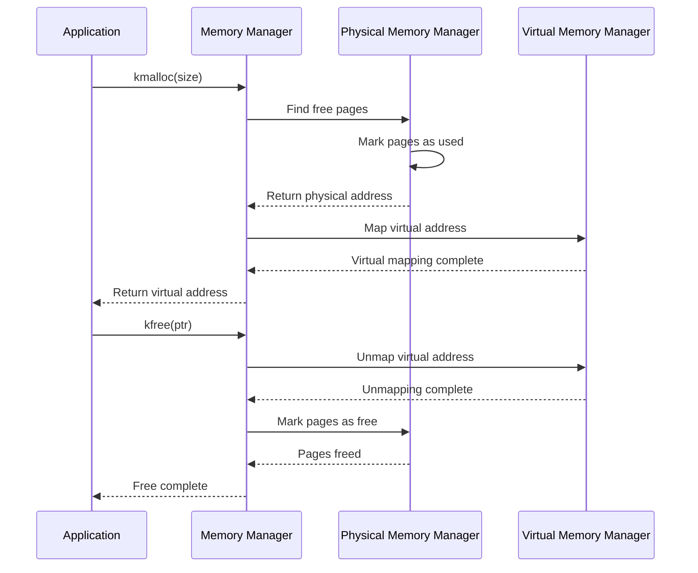
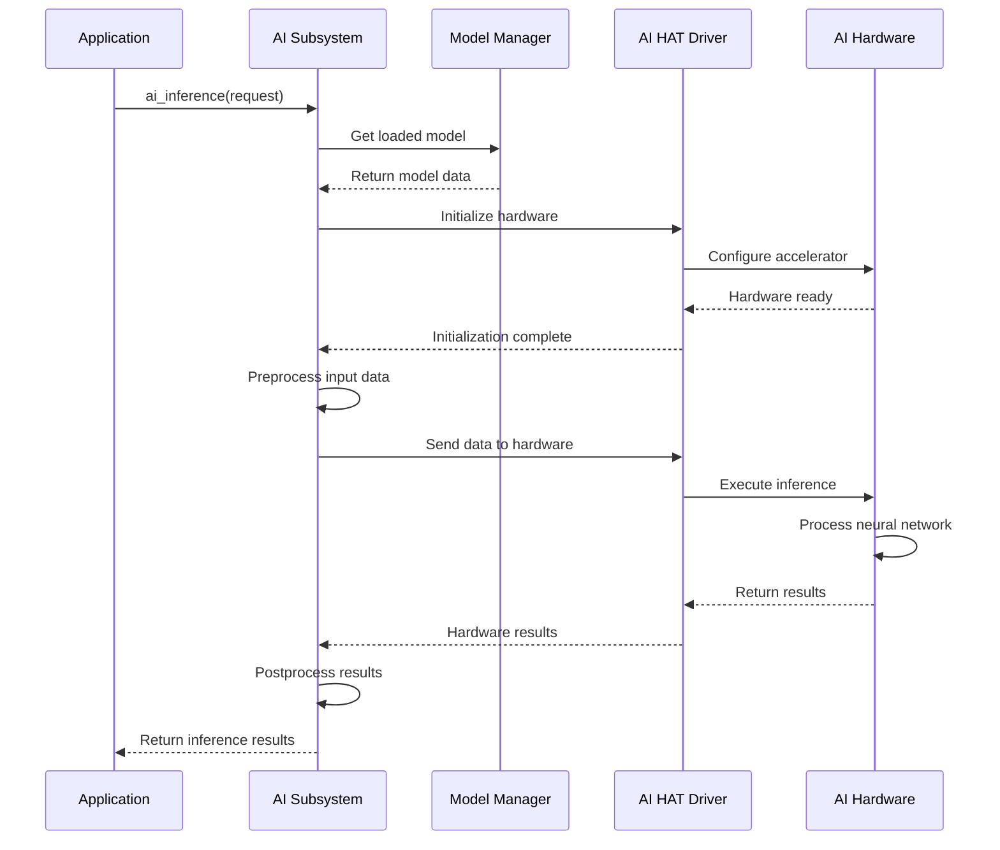

# SAGE OS API Reference
{: .no_toc }

Complete API documentation for all SAGE OS modules and components.
{: .fs-6 .fw-300 }

## Table of Contents
{: .no_toc .text-delta }

1. TOC
{:toc}

---

## Core Kernel API

### Kernel Core (`kernel/kernel.h`)

The kernel core provides fundamental system services and initialization.

#### Functions

```c
/**
 * Initialize the kernel and all subsystems
 * Called from boot loader after hardware initialization
 */
void kernel_main(void);

/**
 * Initialize kernel subsystems
 * @return 0 on success, negative error code on failure
 */
int kernel_init(void);

/**
 * Halt the system gracefully
 * Performs cleanup and stops all operations
 */
void system_halt(void);

/**
 * Reboot the system
 * Performs warm reset of the system
 */
void system_reboot(void);

/**
 * Kernel panic - fatal error handler
 * @param message Error message to display
 */
void panic(const char* message);

/**
 * Get system uptime in milliseconds
 * @return System uptime since boot
 */
uint64_t get_uptime(void);

/**
 * Get kernel version information
 * @return Pointer to version string
 */
const char* get_kernel_version(void);
```

#### Usage Example

```c
#include "kernel/kernel.h"

void my_kernel_module_init(void) {
    // Check kernel version compatibility
    const char* version = get_kernel_version();
    printf("Running on SAGE OS %s\n", version);
    
    // Get system uptime
    uint64_t uptime = get_uptime();
    printf("System uptime: %llu ms\n", uptime);
}
```

---

## Memory Management API

### Memory Manager (`kernel/memory.h`)

Advanced memory management with virtual memory support.

#### Data Structures

```c
/**
 * Memory region descriptor
 */
typedef struct memory_region {
    void* start;        /* Start address */
    size_t size;        /* Size in bytes */
    uint32_t flags;     /* Access flags */
    struct memory_region* next;
} memory_region_t;

/**
 * Memory statistics
 */
typedef struct memory_stats {
    size_t total_memory;    /* Total system memory */
    size_t free_memory;     /* Available memory */
    size_t used_memory;     /* Used memory */
    size_t kernel_memory;   /* Kernel memory usage */
    size_t user_memory;     /* User space memory */
} memory_stats_t;
```

#### Functions

```c
/**
 * Initialize memory management subsystem
 * @return 0 on success, negative error code on failure
 */
int memory_init(void);

/**
 * Allocate kernel memory
 * @param size Number of bytes to allocate
 * @return Pointer to allocated memory, NULL on failure
 */
void* kmalloc(size_t size);

/**
 * Free kernel memory
 * @param ptr Pointer to memory to free
 */
void kfree(void* ptr);

/**
 * Allocate virtual memory
 * @param size Number of bytes to allocate
 * @return Pointer to allocated memory, NULL on failure
 */
void* vmalloc(size_t size);

/**
 * Free virtual memory
 * @param ptr Pointer to memory to free
 */
void vfree(void* ptr);

/**
 * Allocate a physical page
 * @return Pointer to page, NULL on failure
 */
void* alloc_page(void);

/**
 * Free a physical page
 * @param page Pointer to page to free
 */
void free_page(void* page);

/**
 * Map virtual address to physical address
 * @param virt Virtual address
 * @param phys Physical address
 * @param flags Mapping flags
 * @return 0 on success, negative error code on failure
 */
int map_page(void* virt, void* phys, uint32_t flags);

/**
 * Unmap virtual address
 * @param virt Virtual address to unmap
 * @return 0 on success, negative error code on failure
 */
int unmap_page(void* virt);

/**
 * Get memory statistics
 * @param stats Pointer to statistics structure
 */
void get_memory_stats(memory_stats_t* stats);
```

#### Memory Allocation Flow



---

## AI Subsystem API

### AI Core (`kernel/ai/ai_subsystem.h`)

Integrated AI capabilities for intelligent system behavior.

#### Data Structures

```c
/**
 * AI model descriptor
 */
typedef struct ai_model {
    char name[64];          /* Model name */
    void* data;             /* Model data */
    size_t size;            /* Model size */
    uint32_t version;       /* Model version */
    uint32_t type;          /* Model type */
} ai_model_t;

/**
 * AI inference request
 */
typedef struct ai_request {
    const void* input;      /* Input data */
    size_t input_size;      /* Input data size */
    void* output;           /* Output buffer */
    size_t output_size;     /* Output buffer size */
    uint32_t flags;         /* Processing flags */
} ai_request_t;

/**
 * AI performance metrics
 */
typedef struct ai_metrics {
    uint64_t inference_count;   /* Total inferences */
    uint64_t total_time;        /* Total processing time */
    uint64_t avg_time;          /* Average inference time */
    float accuracy;             /* Model accuracy */
    float confidence;           /* Average confidence */
} ai_metrics_t;
```

#### Functions

```c
/**
 * Initialize AI subsystem
 * @return 0 on success, negative error code on failure
 */
int ai_init(void);

/**
 * Shutdown AI subsystem
 */
void ai_shutdown(void);

/**
 * Load AI model from memory
 * @param model Pointer to model descriptor
 * @return 0 on success, negative error code on failure
 */
int ai_load_model(const ai_model_t* model);

/**
 * Unload AI model
 * @param model_name Name of model to unload
 * @return 0 on success, negative error code on failure
 */
int ai_unload_model(const char* model_name);

/**
 * Perform AI inference
 * @param request Inference request
 * @return 0 on success, negative error code on failure
 */
int ai_inference(const ai_request_t* request);

/**
 * Train AI model with new data
 * @param data Training data
 * @param size Data size
 * @param labels Training labels
 * @return 0 on success, negative error code on failure
 */
int ai_learn_from_data(const void* data, size_t size, const void* labels);

/**
 * Adapt system behavior based on performance
 * @param metric Performance metric
 * @return 0 on success, negative error code on failure
 */
int ai_adapt_behavior(int metric);

/**
 * Get AI performance metrics
 * @param metrics Pointer to metrics structure
 */
void ai_get_metrics(ai_metrics_t* metrics);

/**
 * Set AI configuration
 * @param config Configuration parameters
 * @return 0 on success, negative error code on failure
 */
int ai_set_config(const void* config);
```

#### AI Inference Flow



---

## Device Driver APIs

### UART Driver (`drivers/uart.h`)

Universal Asynchronous Receiver-Transmitter communication.

#### Functions

```c
/**
 * Initialize UART interface
 * @param port UART port number
 * @param baudrate Communication speed
 * @return 0 on success, negative error code on failure
 */
int uart_init(int port, int baudrate);

/**
 * Read data from UART
 * @param port UART port number
 * @param buffer Buffer to store data
 * @param size Maximum bytes to read
 * @return Number of bytes read, negative on error
 */
int uart_read(int port, void* buffer, size_t size);

/**
 * Write data to UART
 * @param port UART port number
 * @param data Data to write
 * @param size Number of bytes to write
 * @return Number of bytes written, negative on error
 */
int uart_write(int port, const void* data, size_t size);

/**
 * Configure UART parameters
 * @param port UART port number
 * @param config Configuration structure
 * @return 0 on success, negative error code on failure
 */
int uart_config(int port, const uart_config_t* config);

/**
 * Check if data is available for reading
 * @param port UART port number
 * @return Number of bytes available
 */
int uart_available(int port);

/**
 * Flush UART buffers
 * @param port UART port number
 * @return 0 on success, negative error code on failure
 */
int uart_flush(int port);
```

### I2C Driver (`drivers/i2c.h`)

Inter-Integrated Circuit communication protocol.

#### Functions

```c
/**
 * Initialize I2C interface
 * @param bus I2C bus number
 * @param speed Communication speed (Hz)
 * @return 0 on success, negative error code on failure
 */
int i2c_init(int bus, int speed);

/**
 * Read data from I2C device
 * @param bus I2C bus number
 * @param addr Device address
 * @param buffer Buffer to store data
 * @param size Number of bytes to read
 * @return Number of bytes read, negative on error
 */
int i2c_read(int bus, uint8_t addr, void* buffer, size_t size);

/**
 * Write data to I2C device
 * @param bus I2C bus number
 * @param addr Device address
 * @param data Data to write
 * @param size Number of bytes to write
 * @return Number of bytes written, negative on error
 */
int i2c_write(int bus, uint8_t addr, const void* data, size_t size);

/**
 * Scan I2C bus for devices
 * @param bus I2C bus number
 * @param devices Array to store found device addresses
 * @param max_devices Maximum number of devices to find
 * @return Number of devices found
 */
int i2c_scan(int bus, uint8_t* devices, int max_devices);

/**
 * Read register from I2C device
 * @param bus I2C bus number
 * @param addr Device address
 * @param reg Register address
 * @return Register value, negative on error
 */
int i2c_read_reg(int bus, uint8_t addr, uint8_t reg);

/**
 * Write register to I2C device
 * @param bus I2C bus number
 * @param addr Device address
 * @param reg Register address
 * @param value Value to write
 * @return 0 on success, negative error code on failure
 */
int i2c_write_reg(int bus, uint8_t addr, uint8_t reg, uint8_t value);
```

### SPI Driver (`drivers/spi.h`)

Serial Peripheral Interface communication.

#### Functions

```c
/**
 * Initialize SPI interface
 * @param bus SPI bus number
 * @param config SPI configuration
 * @return 0 on success, negative error code on failure
 */
int spi_init(int bus, const spi_config_t* config);

/**
 * Transfer data via SPI
 * @param bus SPI bus number
 * @param tx_data Data to transmit
 * @param rx_data Buffer for received data
 * @param size Number of bytes to transfer
 * @return Number of bytes transferred, negative on error
 */
int spi_transfer(int bus, const void* tx_data, void* rx_data, size_t size);

/**
 * Write data via SPI
 * @param bus SPI bus number
 * @param data Data to write
 * @param size Number of bytes to write
 * @return Number of bytes written, negative on error
 */
int spi_write(int bus, const void* data, size_t size);

/**
 * Read data via SPI
 * @param bus SPI bus number
 * @param buffer Buffer to store data
 * @param size Number of bytes to read
 * @return Number of bytes read, negative on error
 */
int spi_read(int bus, void* buffer, size_t size);

/**
 * Configure SPI parameters
 * @param bus SPI bus number
 * @param config Configuration structure
 * @return 0 on success, negative error code on failure
 */
int spi_config(int bus, const spi_config_t* config);
```

---

## Shell Interface API

### Shell Core (`kernel/shell.h`)

Interactive command shell for system interaction.

#### Functions

```c
/**
 * Initialize shell interface
 * @return 0 on success, negative error code on failure
 */
int shell_init(void);

/**
 * Process shell command
 * @param command Command string
 * @return 0 on success, negative error code on failure
 */
int shell_execute(const char* command);

/**
 * Register new shell command
 * @param name Command name
 * @param handler Command handler function
 * @param help Help text
 * @return 0 on success, negative error code on failure
 */
int shell_register_command(const char* name, 
                          int (*handler)(int argc, char* argv[]), 
                          const char* help);

/**
 * Unregister shell command
 * @param name Command name
 * @return 0 on success, negative error code on failure
 */
int shell_unregister_command(const char* name);

/**
 * Print shell prompt
 */
void shell_prompt(void);

/**
 * Get command history
 * @param history Array to store history
 * @param max_entries Maximum entries to return
 * @return Number of history entries
 */
int shell_get_history(char** history, int max_entries);
```

#### Built-in Commands

| Command | Description | Usage |
|---------|-------------|-------|
| `help` | Show available commands | `help [command]` |
| `version` | Show system version | `version` |
| `uptime` | Show system uptime | `uptime` |
| `memory` | Show memory usage | `memory [stats]` |
| `ai` | AI subsystem commands | `ai <load\|unload\|inference\|stats>` |
| `drivers` | Driver management | `drivers <list\|info\|reload>` |
| `reboot` | Restart system | `reboot` |
| `halt` | Shutdown system | `halt` |

---

## Standard I/O API

### stdio (`kernel/stdio.h`)

Standard input/output operations.

#### Functions

```c
/**
 * Print formatted string
 * @param format Format string
 * @param ... Variable arguments
 * @return Number of characters printed
 */
int printf(const char* format, ...);

/**
 * Print formatted string to buffer
 * @param buffer Output buffer
 * @param size Buffer size
 * @param format Format string
 * @param ... Variable arguments
 * @return Number of characters written
 */
int snprintf(char* buffer, size_t size, const char* format, ...);

/**
 * Print string
 * @param str String to print
 * @return Number of characters printed
 */
int puts(const char* str);

/**
 * Print character
 * @param c Character to print
 * @return Character printed
 */
int putchar(int c);

/**
 * Read character
 * @return Character read, EOF on error
 */
int getchar(void);

/**
 * Read string
 * @param buffer Buffer to store string
 * @param size Maximum characters to read
 * @return Pointer to buffer, NULL on error
 */
char* gets(char* buffer, size_t size);
```

---

## Utility Functions API

### Utils (`kernel/utils.h`)

Common utility functions and helpers.

#### Functions

```c
/**
 * String length
 * @param str String
 * @return Length of string
 */
size_t strlen(const char* str);

/**
 * String copy
 * @param dest Destination buffer
 * @param src Source string
 * @return Pointer to destination
 */
char* strcpy(char* dest, const char* src);

/**
 * String compare
 * @param str1 First string
 * @param str2 Second string
 * @return 0 if equal, negative if str1 < str2, positive if str1 > str2
 */
int strcmp(const char* str1, const char* str2);

/**
 * Memory copy
 * @param dest Destination buffer
 * @param src Source buffer
 * @param size Number of bytes to copy
 * @return Pointer to destination
 */
void* memcpy(void* dest, const void* src, size_t size);

/**
 * Memory set
 * @param ptr Memory buffer
 * @param value Value to set
 * @param size Number of bytes to set
 * @return Pointer to buffer
 */
void* memset(void* ptr, int value, size_t size);

/**
 * Memory compare
 * @param ptr1 First buffer
 * @param ptr2 Second buffer
 * @param size Number of bytes to compare
 * @return 0 if equal, negative if ptr1 < ptr2, positive if ptr1 > ptr2
 */
int memcmp(const void* ptr1, const void* ptr2, size_t size);

/**
 * Convert integer to string
 * @param value Integer value
 * @param buffer Output buffer
 * @param base Number base (2-36)
 * @return Pointer to buffer
 */
char* itoa(int value, char* buffer, int base);

/**
 * Convert string to integer
 * @param str String to convert
 * @return Integer value
 */
int atoi(const char* str);
```

---

## Error Codes

### Standard Error Codes

```c
#define SUCCESS         0       /* Operation successful */
#define ERROR_GENERIC  -1       /* Generic error */
#define ERROR_NOMEM    -2       /* Out of memory */
#define ERROR_INVALID  -3       /* Invalid parameter */
#define ERROR_TIMEOUT  -4       /* Operation timeout */
#define ERROR_BUSY     -5       /* Resource busy */
#define ERROR_NOTFOUND -6       /* Resource not found */
#define ERROR_PERM     -7       /* Permission denied */
#define ERROR_IO       -8       /* I/O error */
#define ERROR_CORRUPT  -9       /* Data corruption */
#define ERROR_FULL     -10      /* Resource full */
```

### AI-Specific Error Codes

```c
#define AI_ERROR_MODEL_NOT_LOADED   -100   /* Model not loaded */
#define AI_ERROR_INVALID_INPUT      -101   /* Invalid input data */
#define AI_ERROR_INFERENCE_FAILED   -102   /* Inference failed */
#define AI_ERROR_HARDWARE_FAULT     -103   /* Hardware fault */
#define AI_ERROR_MODEL_CORRUPT      -104   /* Model data corrupt */
#define AI_ERROR_UNSUPPORTED_OP     -105   /* Unsupported operation */
```

---

## Next Steps

- [Architecture Overview](../architecture/) - System architecture details
- [Build Guide](../build/) - Build system documentation
- [Testing](../testing/) - API testing procedures
- [Examples](examples/) - Code examples and tutorials