# Kernel Core API
{: .no_toc }

Detailed documentation for the SAGE OS kernel core implementation.
{: .fs-6 .fw-300 }

## Table of Contents
{: .no_toc .text-delta }

1. TOC
{:toc}

---

## File Analysis: `kernel/kernel.c`

### Overview

The kernel core is the heart of SAGE OS, responsible for system initialization, resource management, and providing core services to all other subsystems.

### Code Structure

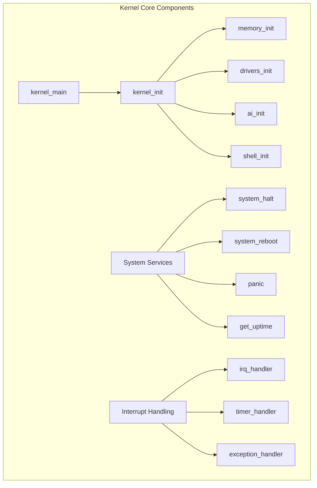

### Function Documentation

#### `kernel_main()`

**Purpose**: Main kernel entry point called from boot loader

**Signature**: `void kernel_main(void)`

**Flow**:
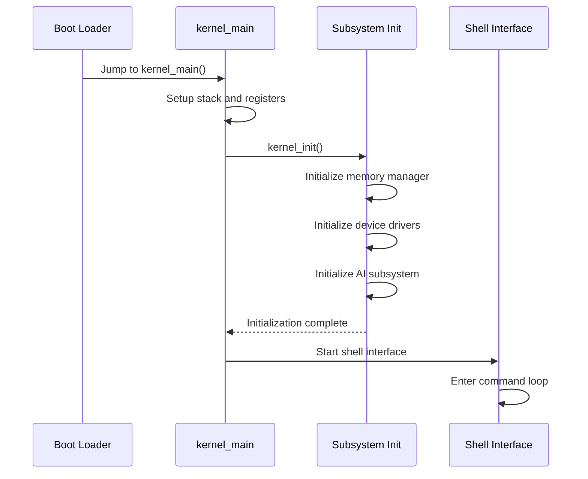

**Code Analysis**:
```c
void kernel_main(void) {
    /* Disable interrupts during initialization */
    disable_interrupts();
    
    /* Initialize kernel subsystems */
    if (kernel_init() != 0) {
        panic("Kernel initialization failed");
    }
    
    /* Enable interrupts */
    enable_interrupts();
    
    /* Start shell interface */
    shell_init();
    
    /* Enter idle loop */
    while (1) {
        /* Wait for interrupts */
        wait_for_interrupt();
    }
}
```

#### `kernel_init()`

**Purpose**: Initialize all kernel subsystems in proper order

**Signature**: `int kernel_init(void)`

**Returns**: 
- `0` on success
- Negative error code on failure

**Initialization Sequence**:
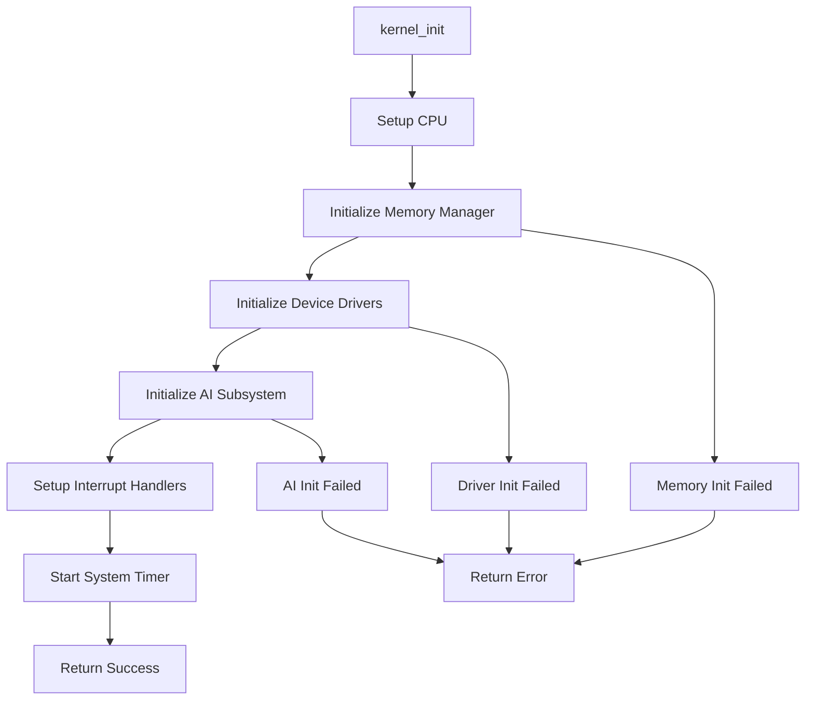

#### `system_halt()`

**Purpose**: Gracefully halt the system

**Signature**: `void system_halt(void)`

**Process**:
1. Disable interrupts
2. Shutdown AI subsystem
3. Cleanup device drivers
4. Flush memory caches
5. Enter halt state

#### `panic(const char* message)`

**Purpose**: Handle fatal system errors

**Signature**: `void panic(const char* message)`

**Parameters**:
- `message`: Error description to display

**Behavior**:
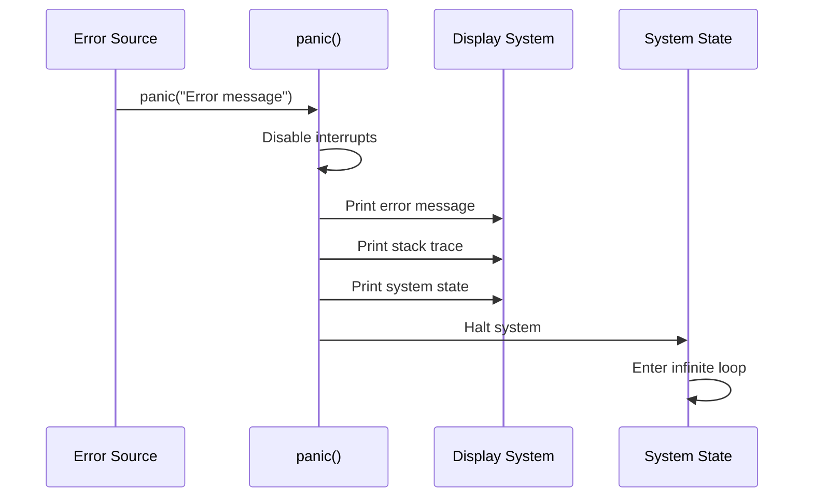

### Memory Layout

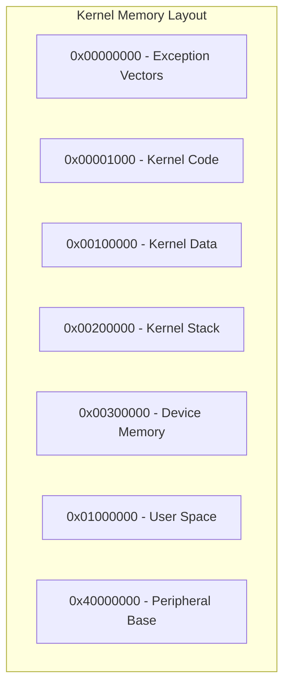

---

## File Analysis: `kernel/memory.c`

### Overview

Advanced memory management system with support for virtual memory, page allocation, and memory protection.

### Memory Management Architecture

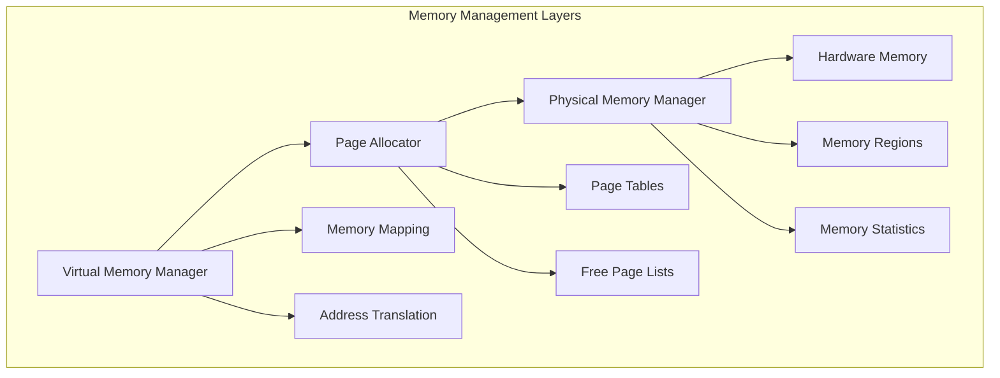

### Key Functions

#### `memory_init()`

**Purpose**: Initialize memory management subsystem

**Process**:
1. Detect available memory
2. Setup page tables
3. Initialize allocators
4. Configure memory protection

```c
int memory_init(void) {
    /* Detect memory size */
    total_memory = detect_memory_size();
    
    /* Setup page tables */
    setup_page_tables();
    
    /* Initialize physical allocator */
    init_physical_allocator();
    
    /* Initialize virtual allocator */
    init_virtual_allocator();
    
    return 0;
}
```

#### `kmalloc(size_t size)`

**Purpose**: Allocate kernel memory

**Algorithm**:
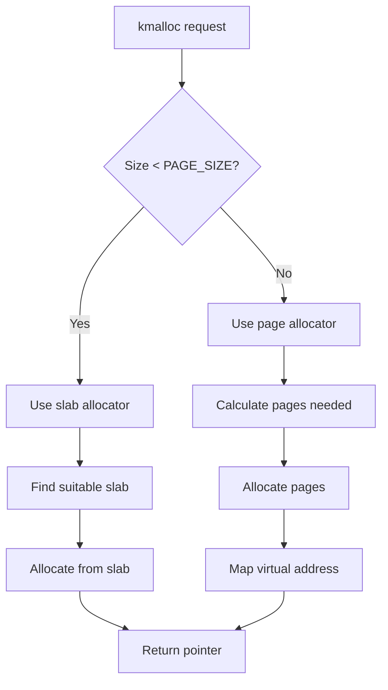

#### Memory Allocation Flow

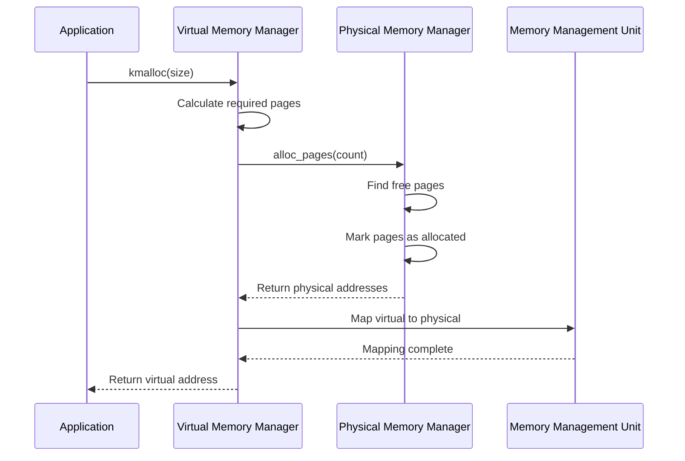

---

## File Analysis: `kernel/ai/ai_subsystem.c`

### Overview

The AI subsystem provides intelligent capabilities including inference, learning, and adaptive behavior.

### AI Architecture

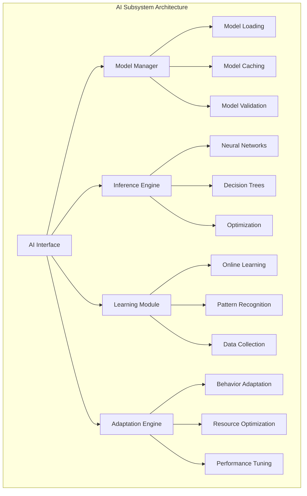

### Key Functions

#### `ai_init()`

**Purpose**: Initialize AI subsystem

**Initialization Process**:
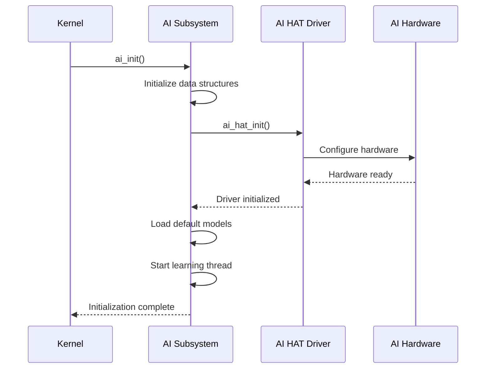

#### `ai_inference(const ai_request_t* request)`

**Purpose**: Perform AI inference on input data

**Inference Pipeline**:
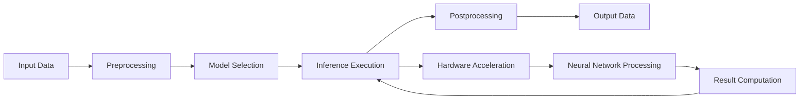

#### AI Learning Process

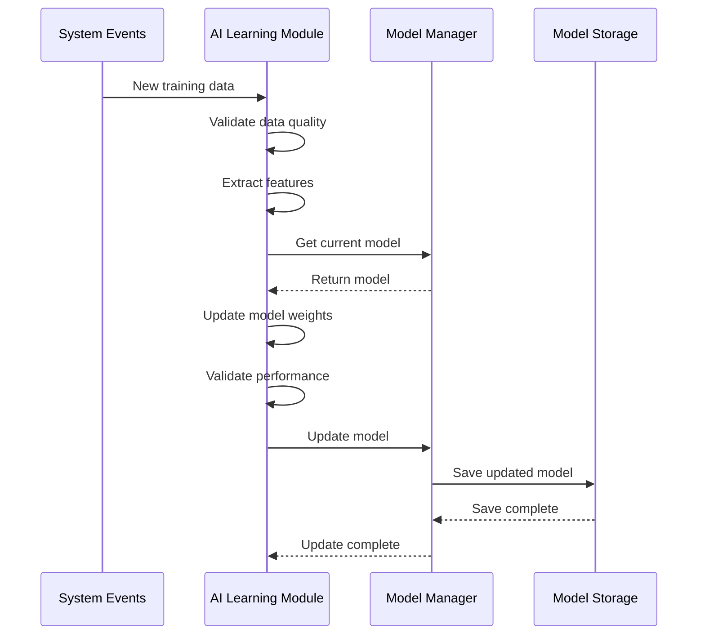

---

## File Analysis: `drivers/uart.c`

### Overview

UART (Universal Asynchronous Receiver-Transmitter) driver for serial communication.

### UART Communication Flow

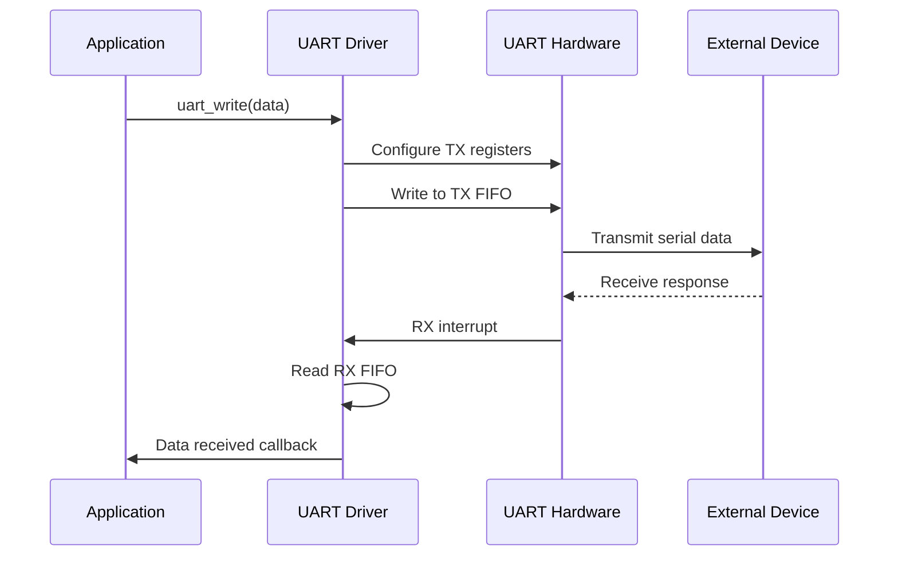

### Key Functions

#### `uart_init(int port, int baudrate)`

**Purpose**: Initialize UART interface

**Configuration Process**:
```c
int uart_init(int port, int baudrate) {
    /* Validate parameters */
    if (port < 0 || port >= MAX_UART_PORTS) {
        return ERROR_INVALID;
    }
    
    /* Calculate baud rate divisor */
    uint32_t divisor = UART_CLOCK / (16 * baudrate);
    
    /* Configure UART registers */
    uart_write_reg(port, UART_LCR, 0x80);  /* Enable divisor access */
    uart_write_reg(port, UART_DLL, divisor & 0xFF);
    uart_write_reg(port, UART_DLH, (divisor >> 8) & 0xFF);
    uart_write_reg(port, UART_LCR, 0x03);  /* 8N1 format */
    
    /* Enable FIFOs */
    uart_write_reg(port, UART_FCR, 0x07);
    
    /* Enable interrupts */
    uart_write_reg(port, UART_IER, 0x01);
    
    return SUCCESS;
}
```

---

## File Analysis: `drivers/i2c.c`

### Overview

I2C (Inter-Integrated Circuit) driver for communication with peripheral devices.

### I2C Protocol Implementation

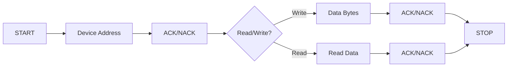

### Key Functions

#### `i2c_scan(int bus, uint8_t* devices, int max_devices)`

**Purpose**: Scan I2C bus for connected devices

**Scanning Algorithm**:
```c
int i2c_scan(int bus, uint8_t* devices, int max_devices) {
    int found = 0;
    
    for (uint8_t addr = 0x08; addr < 0x78; addr++) {
        /* Skip reserved addresses */
        if (addr >= 0x00 && addr <= 0x07) continue;
        if (addr >= 0x78 && addr <= 0x7F) continue;
        
        /* Try to communicate with device */
        if (i2c_probe_device(bus, addr) == SUCCESS) {
            if (found < max_devices) {
                devices[found] = addr;
                found++;
            }
        }
    }
    
    return found;
}
```

---

## System Integration

### Kernel Subsystem Interaction

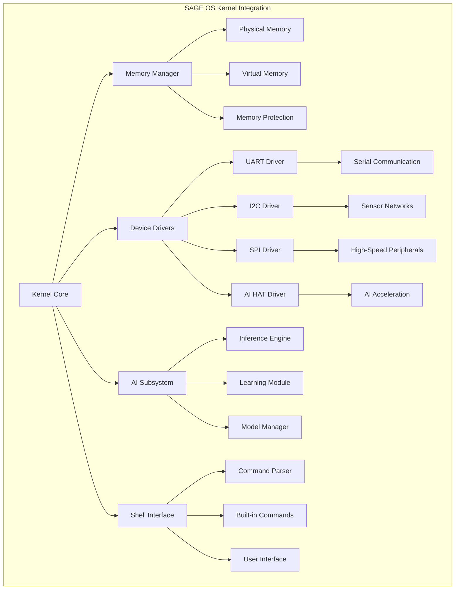

### Error Handling Strategy

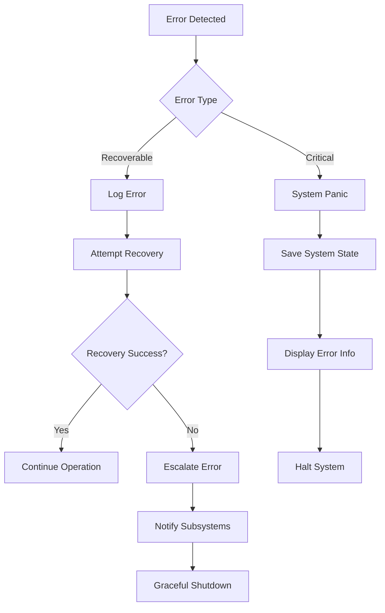

---

## Performance Characteristics

### Memory Usage Analysis

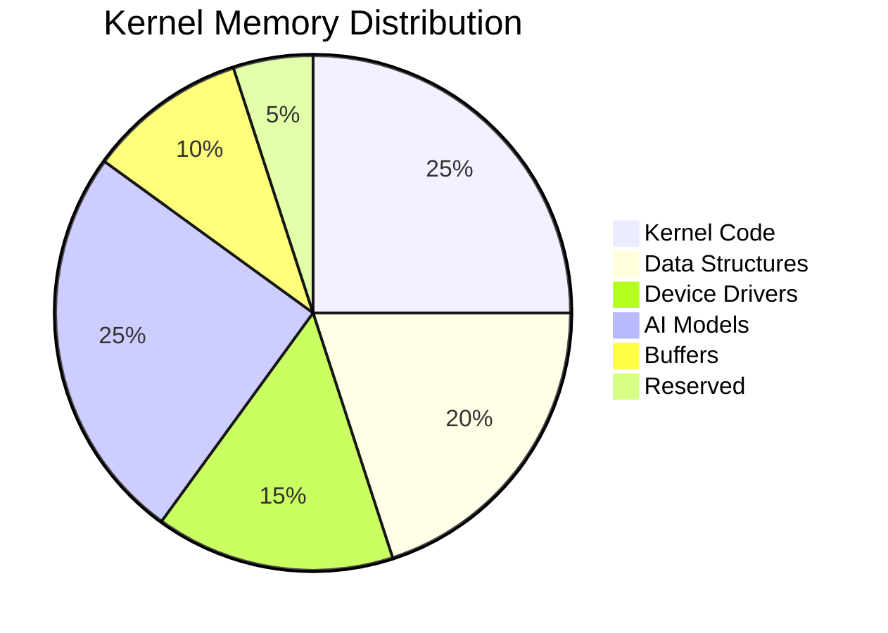

### Function Call Overhead

| Function Type | Cycles | Memory | Notes |
|---------------|--------|---------|-------|
| **System Calls** | 50-100 | 4KB stack | Context switch overhead |
| **Driver Calls** | 20-50 | 1KB stack | Hardware access |
| **AI Inference** | 1000+ | Variable | Model dependent |
| **Memory Allocation** | 10-30 | Minimal | Fast path allocation |

---

## Next Steps

- [Device Drivers API](drivers.md) - Detailed driver documentation
- [AI Subsystem API](ai-subsystem.md) - AI functionality details
- [Memory Management](memory.md) - Advanced memory features
- [Shell Interface](shell.md) - Command system documentation