# SAGE OS Architecture
{: .no_toc }

Comprehensive architectural documentation for SAGE OS components and design patterns.
{: .fs-6 .fw-300 }

## Table of Contents
{: .no_toc .text-delta }

1. TOC
{:toc}

---

## System Architecture

SAGE OS follows a modular, layered architecture designed for embedded systems with AI capabilities:

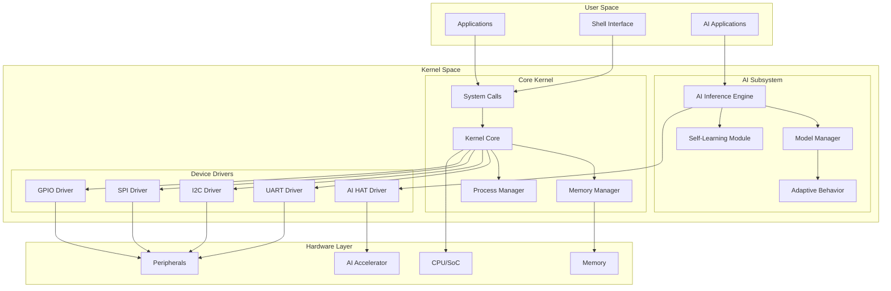

## Core Components

### 1. Boot System

The boot system initializes the hardware and loads the kernel:

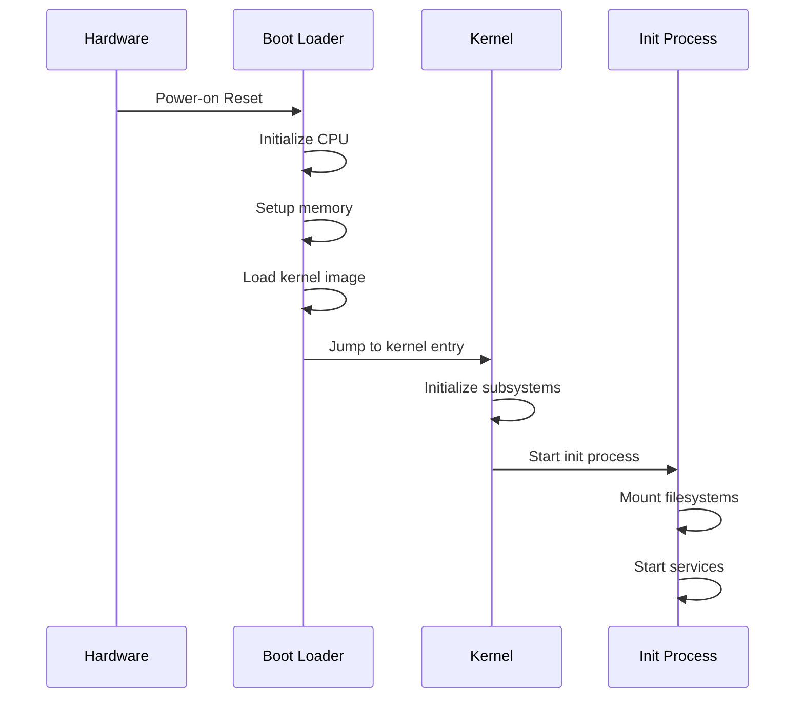

**Files:**
- `boot/boot.S` - Assembly boot loader
- `minimal/boot.S` - Minimal boot implementation
- `prototype/boot/boot.S` - Prototype boot system

### 2. Kernel Core

The kernel core manages system resources and provides core services:

**Key Files:**
- `kernel/kernel.c` - Main kernel implementation
- `kernel/kernel.h` - Kernel interface definitions
- `kernel/types.h` - System type definitions

**Core Functions:**
```c
// Kernel initialization
void kernel_main(void);
void kernel_init(void);

// System management
void system_halt(void);
void system_reboot(void);
void panic(const char* message);
```

### 3. Memory Management

Advanced memory management with virtual memory support:

**Files:**
- `kernel/memory.c` - Memory management implementation
- `kernel/memory.h` - Memory management interface

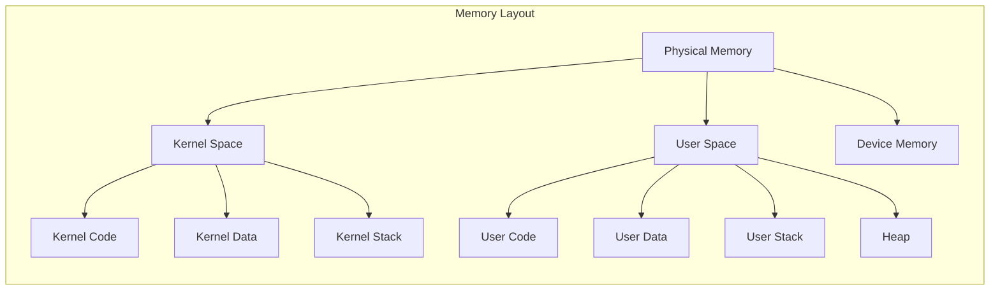

**Memory Functions:**
```c
// Memory allocation
void* kmalloc(size_t size);
void kfree(void* ptr);
void* vmalloc(size_t size);

// Page management
void* alloc_page(void);
void free_page(void* page);
int map_page(void* virt, void* phys, uint32_t flags);
```

### 4. AI Subsystem

Integrated AI capabilities for intelligent system behavior:

**Files:**
- `kernel/ai/ai_subsystem.c` - Core AI implementation
- `kernel/ai/ai_subsystem.h` - AI interface definitions
- `drivers/ai_hat/ai_hat.c` - AI hardware driver

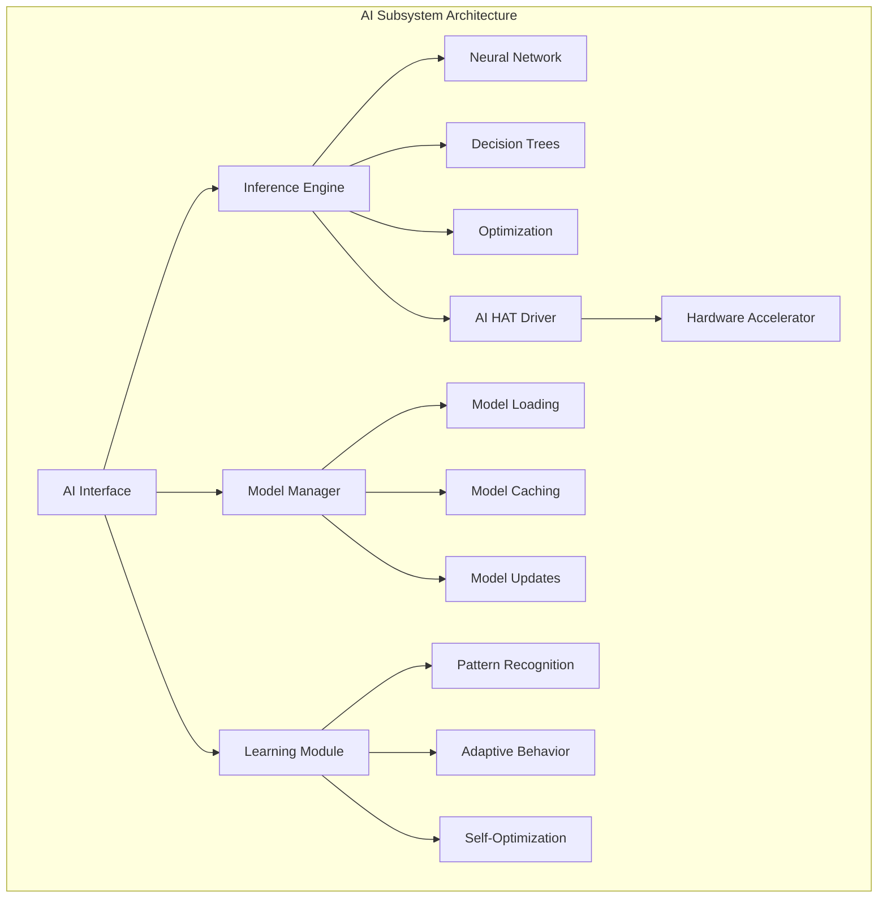

**AI Functions:**
```c
// AI initialization
int ai_init(void);
void ai_shutdown(void);

// Inference operations
int ai_inference(const void* input, void* output, size_t size);
int ai_load_model(const char* model_path);

// Learning and adaptation
int ai_learn_from_data(const void* data, size_t size);
int ai_adapt_behavior(int performance_metric);
```

## Device Driver Architecture

### Driver Framework

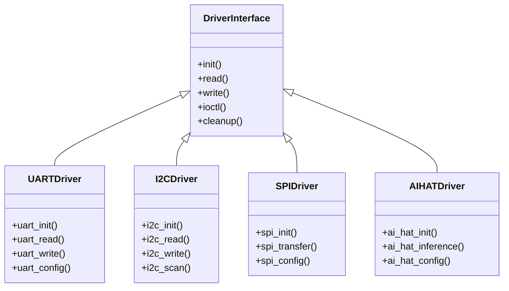

### Communication Protocols

#### UART Communication Flow
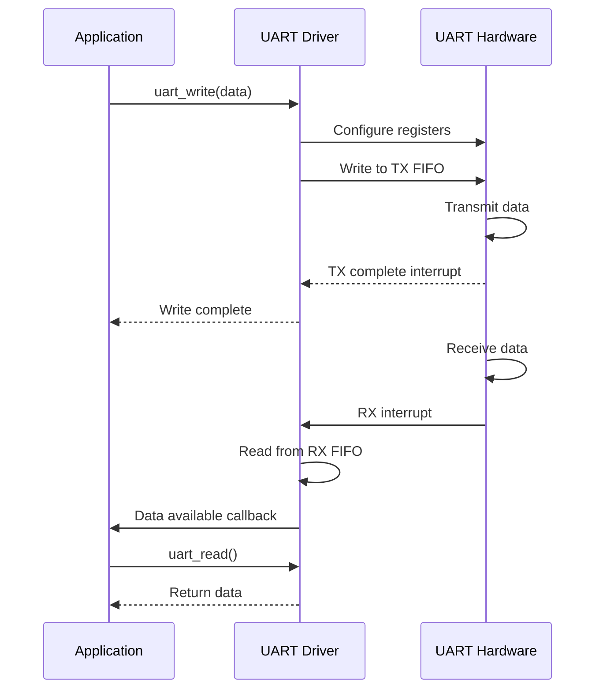

#### I2C Communication Flow
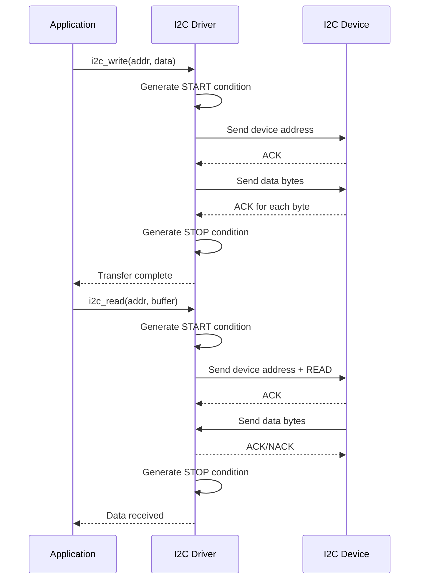

## Multi-Architecture Support

SAGE OS supports multiple architectures through a unified build system:

### Architecture Abstraction

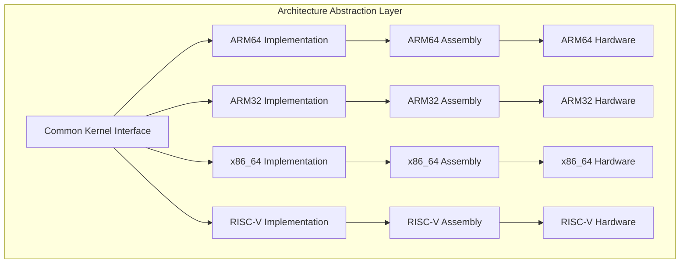

### Platform Support Matrix

| Feature | ARM64 | ARM32 | x86_64 | RISC-V |
|---------|-------|-------|--------|--------|
| **Boot Loader** | ✅ | ✅ | ✅ | ✅ |
| **Memory Management** | ✅ | ✅ | ✅ | ✅ |
| **Device Drivers** | ✅ | ✅ | ✅ | ✅ |
| **AI Subsystem** | ✅ | ✅ | ✅ | ✅ |
| **UART Support** | ✅ | ✅ | ✅ | ✅ |
| **I2C Support** | ✅ | ✅ | ✅ | ✅ |
| **SPI Support** | ✅ | ✅ | ✅ | ✅ |
| **AI HAT Support** | ✅ | ✅ | ❌ | ❌ |
| **QEMU Testing** | ✅ | ✅ | ✅ | ✅ |

## Performance Characteristics

### Memory Usage

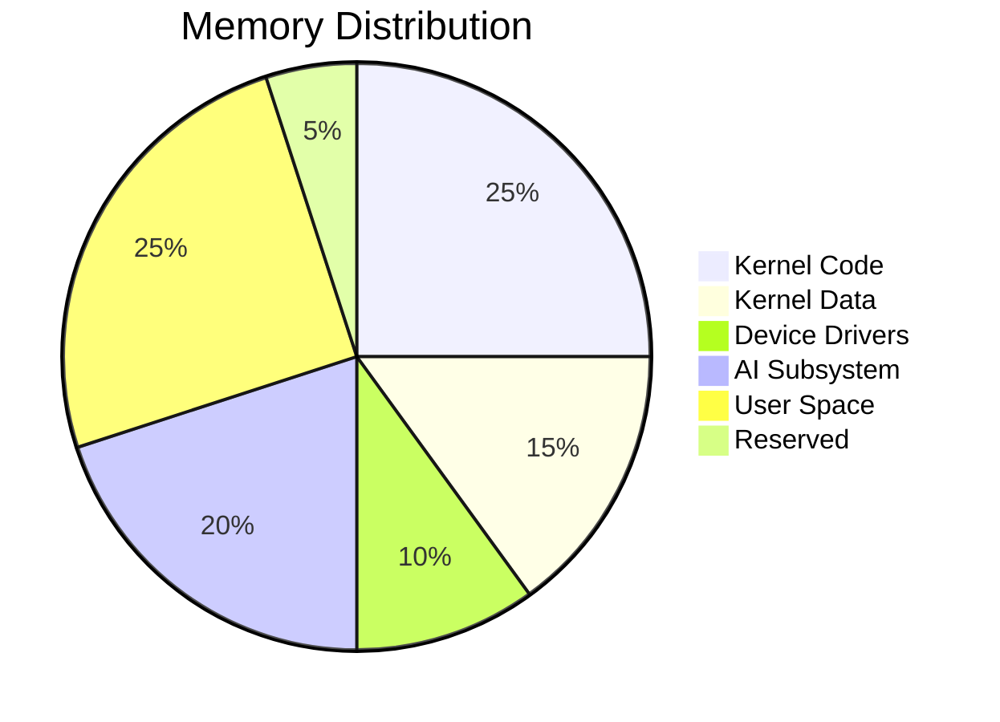

### Boot Time Analysis

```mermaid
gantt
    title SAGE OS Boot Sequence
    dateFormat X
    axisFormat %s
    
    section Hardware Init
    Power-on Reset    :0, 100
    CPU Init         :100, 200
    Memory Init      :200, 400
    
    section Kernel Load
    Boot Loader      :400, 600
    Kernel Load      :600, 800
    Kernel Init      :800, 1200
    
    section Subsystems
    Memory Manager   :1200, 1400
    Device Drivers   :1400, 1800
    AI Subsystem     :1800, 2200
    Shell Interface  :2200, 2400
    
    section Ready
    System Ready     :2400, 2500
```

## Security Architecture

### Security Layers

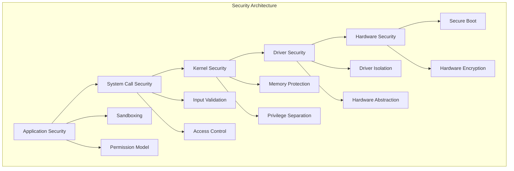

## Next Steps

- [API Reference](../api/) - Detailed API documentation
- [Build Guide](../build/) - Build system documentation
- [Testing](../testing/) - Testing procedures and frameworks
- [Deployment](../deployment/) - Production deployment guides