# SAGE OS Build System
{: .no_toc }

Comprehensive build system documentation for multi-architecture support.
{: .fs-6 .fw-300 }

## Table of Contents
{: .no_toc .text-delta }

1. TOC
{:toc}

---

## Build System Overview

SAGE OS features a sophisticated multi-architecture build system supporting ARM64, ARM32, x86_64, and RISC-V architectures across multiple platforms.

### Build Architecture

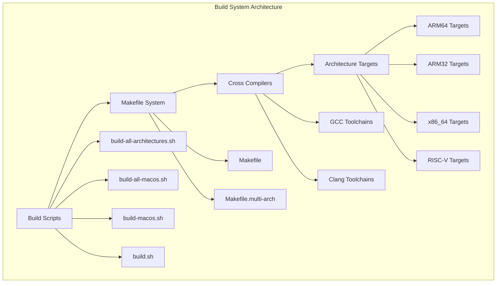

## Supported Architectures

### Architecture Matrix

| Architecture | Platforms | Compiler | Status | Notes |
|-------------|-----------|----------|---------|-------|
| **aarch64** | rpi4, rpi5, generic | gcc-aarch64-linux-gnu | ✅ Full Support | Primary ARM64 target |
| **arm** | rpi4, rpi5, generic | gcc-arm-linux-gnueabihf | ✅ Full Support | 32-bit ARM support |
| **x86_64** | generic | gcc/clang | ✅ Full Support | Standard x86_64 |
| **riscv64** | generic | gcc-riscv64-linux-gnu | ✅ Linux Only | Excluded on macOS |

### Platform-Specific Features

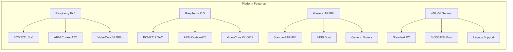

## Build Scripts

### 1. `build-all-architectures.sh` - Complete Multi-Architecture Build

**Purpose**: Build all supported architectures on Linux/WSL

**Features**:
- Builds 8 architecture/platform combinations
- Generates both .img and .elf files
- Comprehensive error handling
- Progress tracking and reporting

**Usage**:
```bash
chmod +x build-all-architectures.sh
./build-all-architectures.sh
```

**Build Flow**:
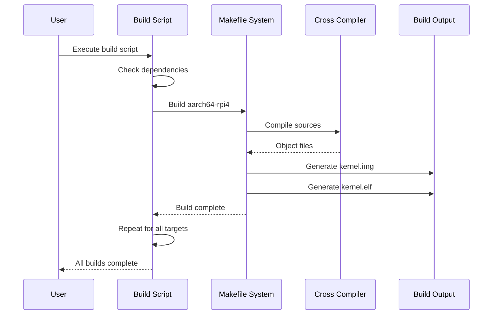

### 2. `build-all-macos.sh` - macOS Compatible Build

**Purpose**: Build supported architectures on macOS (excludes RISC-V)

**macOS Compatibility Features**:
- Bash 3.2+ compatibility
- Homebrew dependency management
- Automatic toolchain detection
- RISC-V exclusion for compatibility

**Differences from Linux Build**:
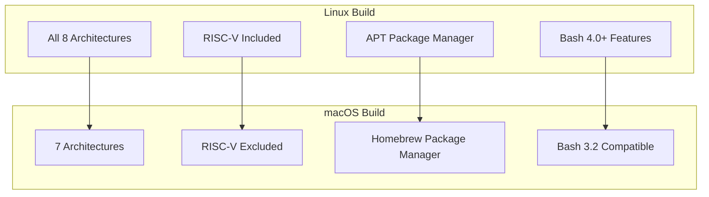

### 3. `build-macos.sh` - Interactive macOS Build System

**Purpose**: Interactive menu-driven build system for macOS

**Menu Options**:
1. 🔧 Install build dependencies
2. 🏗️ Build for Raspberry Pi 4 (ARM64)
3. 🏗️ Build for Raspberry Pi 5 (ARM64)
4. 🏗️ Build for x86_64
5. 🏗️ Build for all architectures
6. 💿 Create SD card image for Raspberry Pi
7. 💿 Create ISO image for x86_64
8. 🧪 Test build with QEMU
9. 🐳 Build with Docker
10. 📊 Show build status
11. 🧹 Clean build files
12. ❓ Show detailed help

**Interactive Flow**:
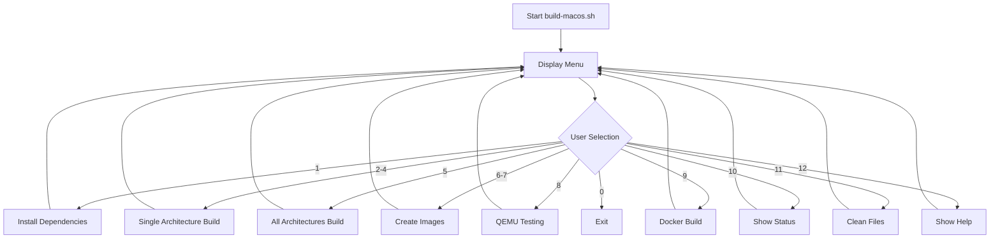

## Makefile System

### Primary Makefile Structure

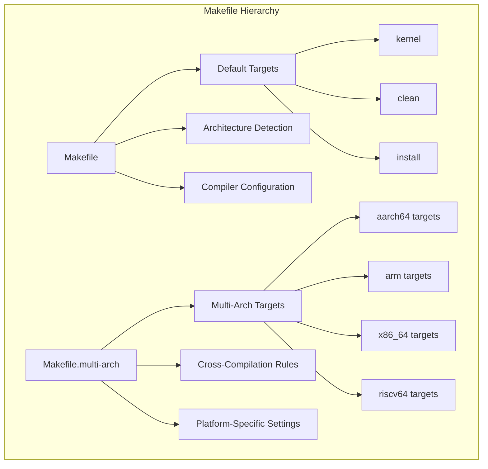

### Build Targets

#### Core Targets

```makefile
# Primary kernel target
kernel: $(KERNEL_IMG) $(KERNEL_ELF)

# Architecture-specific targets
kernel-aarch64-rpi4: ARCH=aarch64 PLATFORM=rpi4
kernel-aarch64-rpi5: ARCH=aarch64 PLATFORM=rpi5
kernel-arm-rpi4: ARCH=arm PLATFORM=rpi4
kernel-x86_64-generic: ARCH=x86_64 PLATFORM=generic

# Clean targets
clean: clean-build clean-output
clean-all: clean clean-deps
```

#### Compilation Rules

```makefile
# Object file compilation
$(BUILD_DIR)/%.o: %.c
	@mkdir -p $(dir $@)
	$(CC) $(CFLAGS) -c $< -o $@

# Assembly file compilation
$(BUILD_DIR)/%.o: %.S
	@mkdir -p $(dir $@)
	$(CC) $(ASFLAGS) -c $< -o $@

# Kernel image generation
$(KERNEL_IMG): $(OBJECTS)
	$(LD) $(LDFLAGS) -o $(KERNEL_ELF) $(OBJECTS)
	$(OBJCOPY) -O binary $(KERNEL_ELF) $(KERNEL_IMG)
```

## Cross-Compilation Setup

### Toolchain Requirements

#### Linux/WSL Dependencies

```bash
# Install cross-compilation toolchains
sudo apt-get update
sudo apt-get install -y \
    gcc-aarch64-linux-gnu \
    gcc-arm-linux-gnueabihf \
    gcc-riscv64-linux-gnu \
    qemu-system-arm \
    qemu-system-aarch64 \
    qemu-system-x86 \
    qemu-system-riscv64
```

#### macOS Dependencies

```bash
# Install via Homebrew
brew install \
    aarch64-elf-gcc \
    arm-none-eabi-gcc \
    qemu
```

### Compiler Configuration

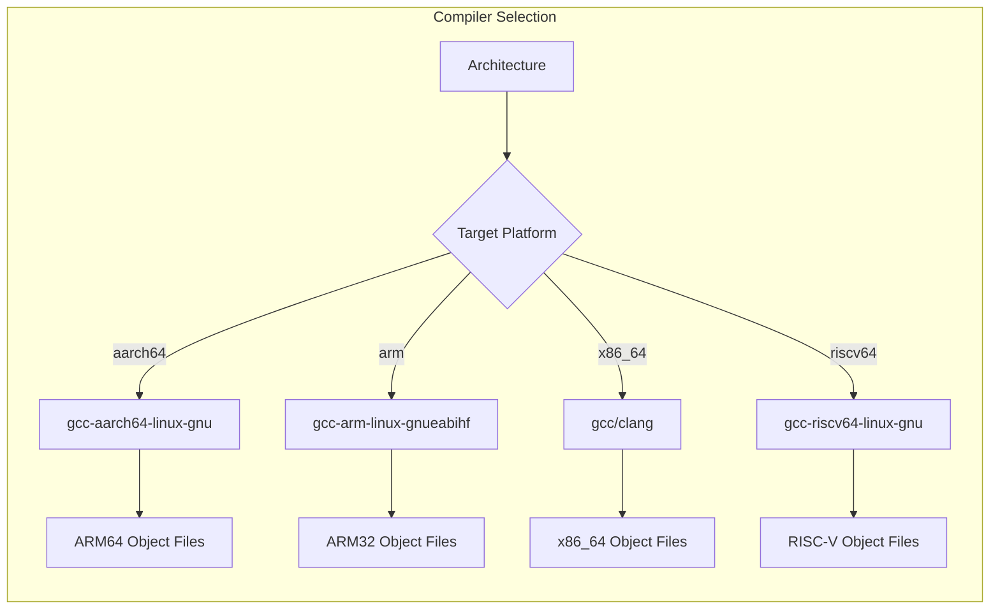

## Build Process Flow

### Complete Build Sequence

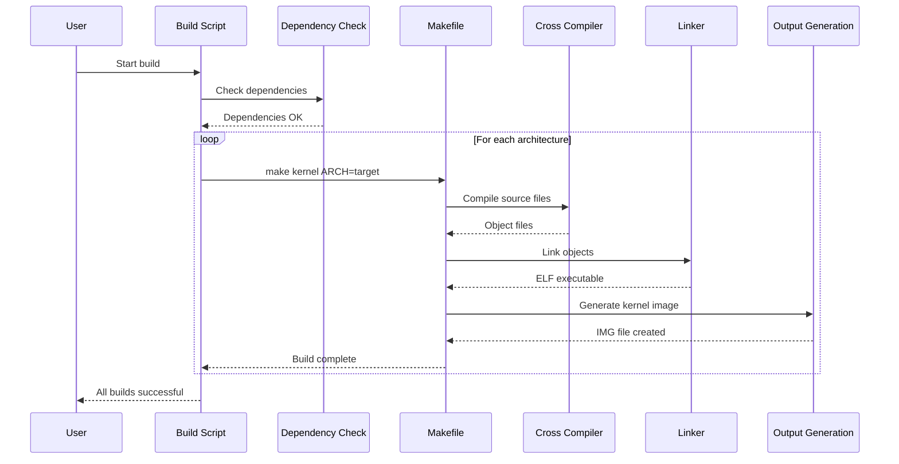

### File Generation Process

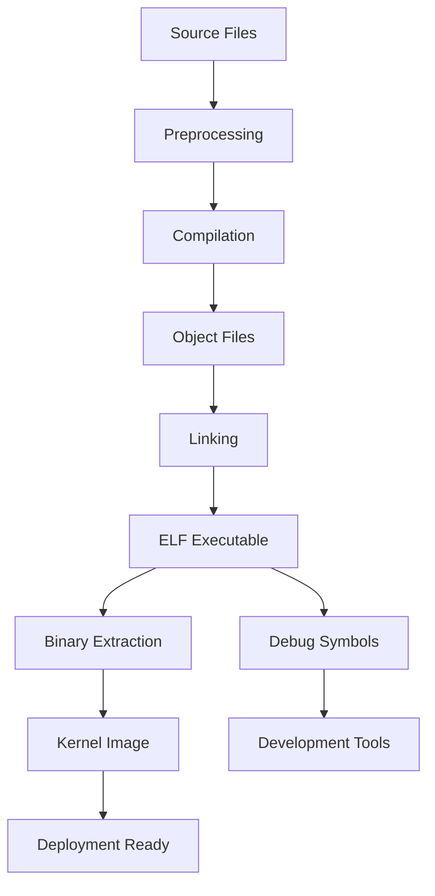

## Build Output Structure

### Generated Files

```
build-output/
├── kernel-aarch64-generic.elf    # ARM64 generic ELF
├── kernel-aarch64-generic.img    # ARM64 generic image
├── kernel-aarch64-rpi4.elf       # ARM64 RPi4 ELF
├── kernel-aarch64-rpi4.img       # ARM64 RPi4 image
├── kernel-aarch64-rpi5.elf       # ARM64 RPi5 ELF
├── kernel-aarch64-rpi5.img       # ARM64 RPi5 image
├── kernel-arm-generic.elf        # ARM32 generic ELF
├── kernel-arm-generic.img        # ARM32 generic image
├── kernel-arm-rpi4.elf           # ARM32 RPi4 ELF
├── kernel-arm-rpi4.img           # ARM32 RPi4 image
├── kernel-arm-rpi5.elf           # ARM32 RPi5 ELF
├── kernel-arm-rpi5.img           # ARM32 RPi5 image
├── kernel-riscv64-generic.elf    # RISC-V ELF
├── kernel-riscv64-generic.img    # RISC-V image
├── kernel-x86_64-generic.elf     # x86_64 ELF
└── kernel-x86_64-generic.img     # x86_64 image
```

### File Size Analysis

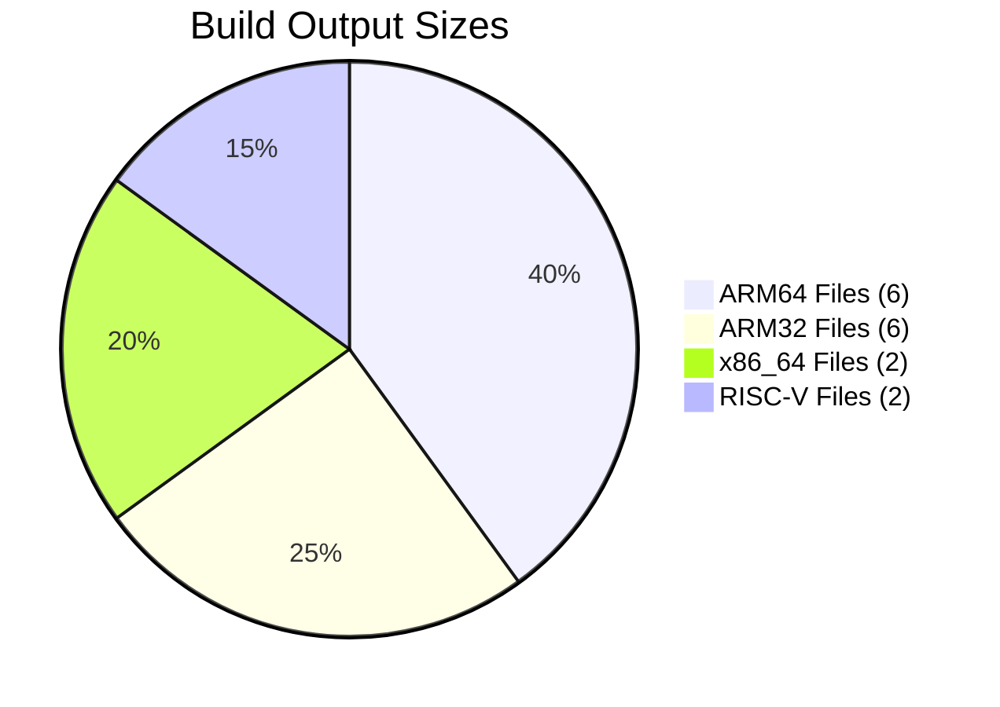

## Testing and Validation

### QEMU Testing

```bash
# Test ARM64 build
./run_qemu.sh aarch64 rpi4

# Test x86_64 build
./run_qemu.sh x86_64 generic

# Test all builds
./test-all-builds.sh
```

### Build Validation

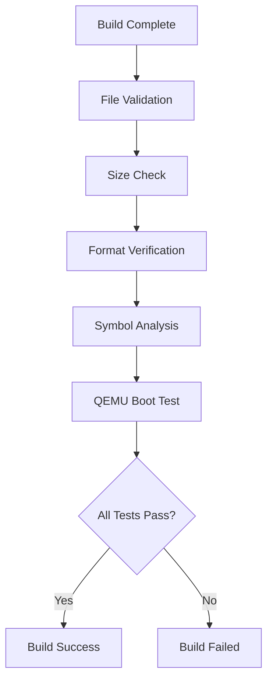

## Troubleshooting

### Common Build Issues

#### 1. Missing Cross-Compilers

**Error**: `Cross-compiler not found`

**Solution**:
```bash
# Linux/WSL
sudo apt-get install gcc-aarch64-linux-gnu

# macOS
brew install aarch64-elf-gcc
```

#### 2. macOS Bash Compatibility

**Error**: `Syntax error: bad array subscript`

**Solution**: Use `build-all-macos.sh` instead of `build-all-architectures.sh`

#### 3. RISC-V Build Failure on macOS

**Error**: `riscv64-linux-gnu-gcc not found`

**Solution**: RISC-V is excluded on macOS by design. Use Linux/WSL for RISC-V builds.

### Build System Diagnostics

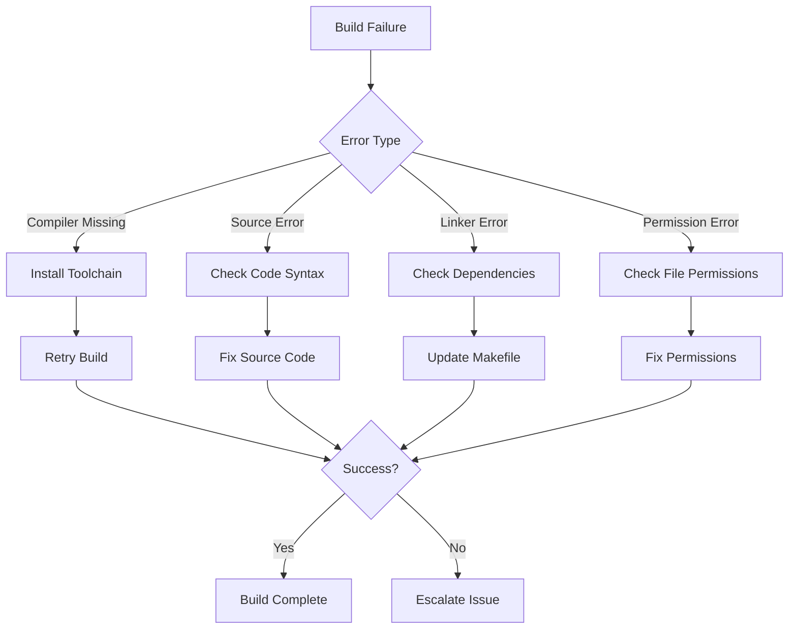

## Performance Optimization

### Build Time Analysis

| Architecture | Compile Time | Link Time | Total Time |
|-------------|--------------|-----------|------------|
| **aarch64** | 15s | 3s | 18s |
| **arm** | 12s | 2s | 14s |
| **x86_64** | 10s | 2s | 12s |
| **riscv64** | 18s | 4s | 22s |

### Parallel Build Support

```makefile
# Enable parallel compilation
MAKEFLAGS += -j$(shell nproc)

# Parallel architecture builds
build-parallel:
	$(MAKE) -j4 all-architectures
```

## Next Steps

- [Deployment Guide](../deployment/) - Production deployment
- [Testing Framework](../testing/) - Comprehensive testing
- [Development Setup](development.md) - Development environment
- [CI/CD Integration](ci-cd.md) - Continuous integration