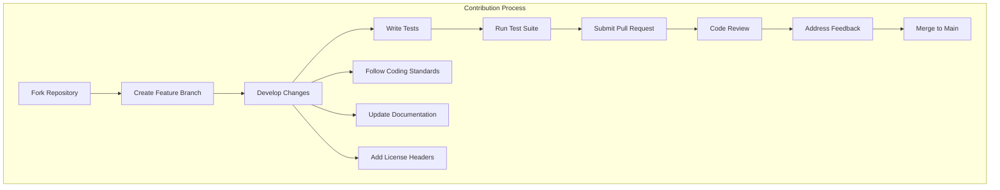
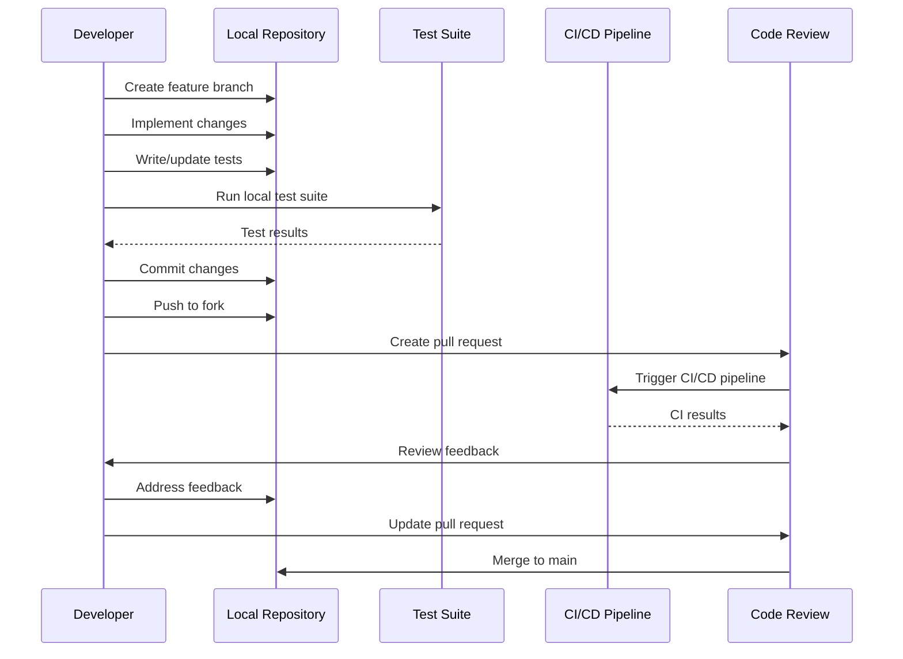
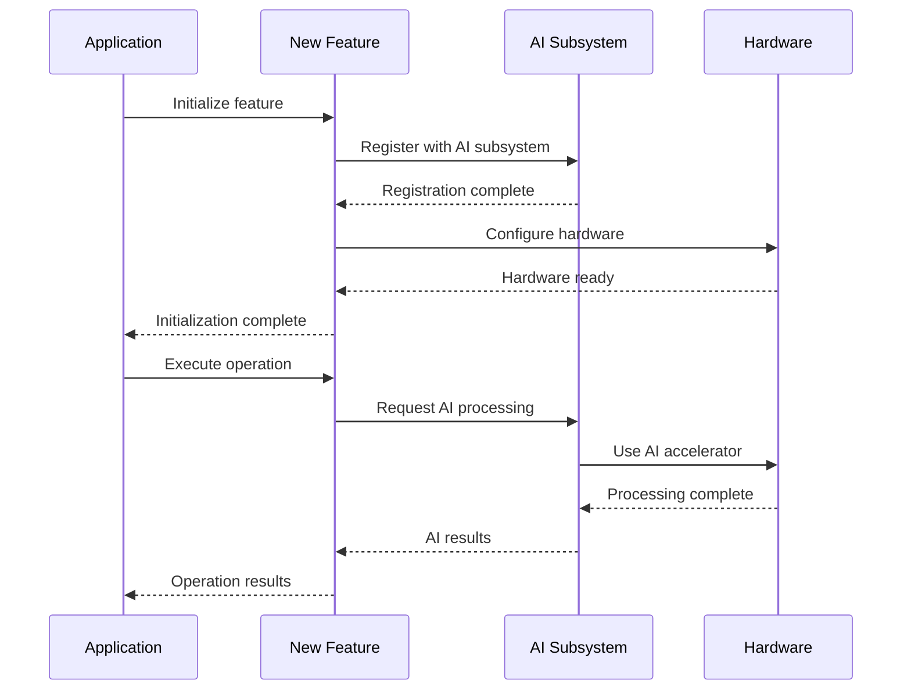
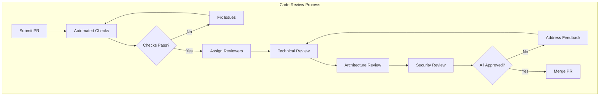
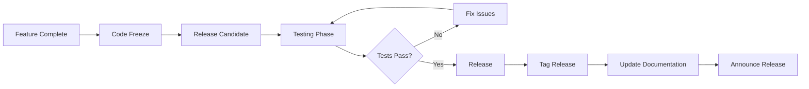

# Contributing to SAGE OS
{: .no_toc }

Guidelines for contributing to the SAGE OS project.
{: .fs-6 .fw-300 }

## Table of Contents
{: .no_toc .text-delta }

1. TOC
{:toc}

---

## Welcome Contributors!

Thank you for your interest in contributing to SAGE OS! This guide will help you get started with contributing to our self-aware, AI-powered embedded operating system.

### Contribution Overview



## Getting Started

### Development Environment Setup

#### Prerequisites

```bash
# Ubuntu/Debian
sudo apt-get update
sudo apt-get install -y \
    build-essential \
    gcc-aarch64-linux-gnu \
    gcc-arm-linux-gnueabihf \
    gcc-riscv64-linux-gnu \
    qemu-system-arm \
    qemu-system-aarch64 \
    qemu-system-x86 \
    qemu-system-riscv64 \
    git \
    python3 \
    python3-pip \
    clang-format \
    cppcheck

# macOS
brew install \
    aarch64-elf-gcc \
    arm-none-eabi-gcc \
    qemu \
    clang-format \
    cppcheck
```

#### Repository Setup

```bash
# Fork and clone the repository
git clone https://github.com/YOUR_USERNAME/SAGE-OS.git
cd SAGE-OS

# Add upstream remote
git remote add upstream https://github.com/hstream-app/SAGE-OS.git

# Create development branch
git checkout -b feature/your-feature-name

# Install development dependencies
pip3 install -r requirements-dev.txt
```

### Development Workflow

#### 1. Branch Naming Convention

```bash
# Feature branches
git checkout -b feature/ai-model-optimization
git checkout -b feature/uart-driver-enhancement

# Bug fix branches
git checkout -b fix/memory-leak-in-ai-subsystem
git checkout -b fix/i2c-timeout-issue

# Documentation branches
git checkout -b docs/api-reference-update
git checkout -b docs/deployment-guide

# Refactoring branches
git checkout -b refactor/memory-manager-cleanup
git checkout -b refactor/driver-interface-standardization
```

#### 2. Development Process



## Coding Standards

### C/C++ Style Guide

#### Code Formatting

We use `clang-format` with the following configuration:

```yaml
# .clang-format
BasedOnStyle: LLVM
IndentWidth: 4
TabWidth: 4
UseTab: Never
ColumnLimit: 100
BreakBeforeBraces: Linux
AlignConsecutiveAssignments: true
AlignConsecutiveDeclarations: true
SpaceAfterCStyleCast: true
PointerAlignment: Right
```

#### Naming Conventions

```c
/* File naming: lowercase with underscores */
// kernel_core.c, memory_manager.h, ai_subsystem.c

/* Function naming: lowercase with underscores */
int memory_init(void);
void ai_process_inference(const ai_request_t *request);
static inline uint32_t get_cpu_frequency(void);

/* Variable naming: lowercase with underscores */
size_t total_memory;
ai_model_t *current_model;
volatile uint32_t *uart_base_addr;

/* Constant naming: uppercase with underscores */
#define MAX_MEMORY_REGIONS  64
#define AI_MODEL_MAGIC      0xABCDEF00
#define UART_BUFFER_SIZE    1024

/* Structure naming: lowercase with _t suffix */
typedef struct memory_region {
    void    *start;
    size_t   size;
    uint32_t flags;
} memory_region_t;

/* Enum naming: uppercase with prefix */
typedef enum {
    AI_STATUS_IDLE,
    AI_STATUS_PROCESSING,
    AI_STATUS_ERROR
} ai_status_t;
```

#### Function Documentation

```c
/**
 * @brief Initialize the AI subsystem
 * 
 * This function initializes the AI subsystem including hardware detection,
 * model loading, and inference engine setup.
 * 
 * @param config Pointer to AI configuration structure
 * @return 0 on success, negative error code on failure
 * 
 * @note This function must be called after memory_init()
 * @warning Calling this function multiple times may cause undefined behavior
 * 
 * @example
 * ai_config_t config = {
 *     .model_path = "/models/default.tflite",
 *     .hardware_acceleration = true
 * };
 * 
 * int result = ai_init(&config);
 * if (result != 0) {
 *     printf("AI initialization failed: %d\n", result);
 * }
 */
int ai_init(const ai_config_t *config);
```

#### Error Handling

```c
/* Use consistent error codes */
#define SUCCESS         0
#define ERROR_NOMEM    -1
#define ERROR_INVALID  -2
#define ERROR_TIMEOUT  -3

/* Always check return values */
int result = memory_init();
if (result != SUCCESS) {
    printf("Memory initialization failed: %d\n", result);
    return result;
}

/* Use goto for cleanup in complex functions */
int complex_function(void) {
    void *buffer = NULL;
    int fd = -1;
    int result = SUCCESS;
    
    buffer = kmalloc(BUFFER_SIZE);
    if (!buffer) {
        result = ERROR_NOMEM;
        goto cleanup;
    }
    
    fd = open_device("/dev/ai_accelerator");
    if (fd < 0) {
        result = ERROR_IO;
        goto cleanup;
    }
    
    /* Main function logic here */
    
cleanup:
    if (buffer) kfree(buffer);
    if (fd >= 0) close_device(fd);
    return result;
}
```

### Python Style Guide

For Python test scripts and tools, we follow PEP 8:

```python
# Function and variable naming: snake_case
def run_ai_inference_test():
    test_data = generate_test_input()
    inference_result = ai_framework.run_inference(test_data)
    return inference_result

# Class naming: PascalCase
class AITestFramework:
    def __init__(self, config_path: str):
        self.config = self._load_config(config_path)
        self.test_results = []
    
    def _load_config(self, path: str) -> dict:
        """Load test configuration from file."""
        with open(path, 'r') as f:
            return json.load(f)

# Constants: UPPER_CASE
MAX_INFERENCE_TIME = 100  # milliseconds
DEFAULT_MODEL_PATH = "/models/test_model.tflite"
```

## License Headers

All source files must include the appropriate license header:

### C/C++ Files

```c
/*
 * SAGE OS - Self-Aware General-purpose Embedded Operating System
 * 
 * Copyright (c) 2024 SAGE OS Development Team
 * 
 * SPDX-License-Identifier: BSD-3-Clause
 * 
 * Redistribution and use in source and binary forms, with or without
 * modification, are permitted provided that the following conditions are met:
 * 
 * 1. Redistributions of source code must retain the above copyright notice,
 *    this list of conditions and the following disclaimer.
 * 
 * 2. Redistributions in binary form must reproduce the above copyright notice,
 *    this list of conditions and the following disclaimer in the documentation
 *    and/or other materials provided with the distribution.
 * 
 * 3. Neither the name of the copyright holder nor the names of its contributors
 *    may be used to endorse or promote products derived from this software
 *    without specific prior written permission.
 * 
 * THIS SOFTWARE IS PROVIDED BY THE COPYRIGHT HOLDERS AND CONTRIBUTORS "AS IS"
 * AND ANY EXPRESS OR IMPLIED WARRANTIES, INCLUDING, BUT NOT LIMITED TO, THE
 * IMPLIED WARRANTIES OF MERCHANTABILITY AND FITNESS FOR A PARTICULAR PURPOSE
 * ARE DISCLAIMED. IN NO EVENT SHALL THE COPYRIGHT HOLDER OR CONTRIBUTORS BE
 * LIABLE FOR ANY DIRECT, INDIRECT, INCIDENTAL, SPECIAL, EXEMPLARY, OR
 * CONSEQUENTIAL DAMAGES (INCLUDING, BUT NOT LIMITED TO, PROCUREMENT OF
 * SUBSTITUTE GOODS OR SERVICES; LOSS OF USE, DATA, OR PROFITS; OR BUSINESS
 * INTERRUPTION) HOWEVER CAUSED AND ON ANY THEORY OF LIABILITY, WHETHER IN
 * CONTRACT, STRICT LIABILITY, OR TORT (INCLUDING NEGLIGENCE OR OTHERWISE)
 * ARISING IN ANY WAY OUT OF THE USE OF THIS SOFTWARE, EVEN IF ADVISED OF THE
 * POSSIBILITY OF SUCH DAMAGE.
 */
```

### Python Files

```python
#!/usr/bin/env python3
"""
SAGE OS - Self-Aware General-purpose Embedded Operating System

Copyright (c) 2024 SAGE OS Development Team

SPDX-License-Identifier: BSD-3-Clause
"""
```

### Automatic License Header Tool

Use the provided tool to add license headers:

```bash
# Add headers to all files
python3 enhanced_license_headers.py

# Check license headers
python3 license-checker.py --check
```

## Testing Requirements

### Test Coverage Requirements

All contributions must maintain or improve test coverage:

```python
# Minimum coverage requirements
COVERAGE_REQUIREMENTS = {
    'line_coverage': 80,      # 80% line coverage
    'branch_coverage': 70,    # 70% branch coverage
    'function_coverage': 90,  # 90% function coverage
}
```

### Writing Tests

#### Unit Tests

```python
# tests/core_tests/test_new_feature.py
import pytest
from sage_os_test import SAGEOSTestFramework

class TestNewFeature:
    def setup_method(self):
        self.framework = SAGEOSTestFramework()
    
    def test_feature_initialization(self):
        """Test that the new feature initializes correctly."""
        result = self.framework.init_new_feature()
        assert result.success == True
        assert result.error_code == 0
    
    def test_feature_functionality(self):
        """Test the main functionality of the new feature."""
        # Setup test data
        test_input = self.framework.generate_test_data()
        
        # Execute feature
        result = self.framework.execute_new_feature(test_input)
        
        # Verify results
        assert result.output is not None
        assert result.processing_time < 100  # ms
        assert result.accuracy > 0.95
    
    def test_feature_error_handling(self):
        """Test error handling in the new feature."""
        # Test with invalid input
        with pytest.raises(ValueError):
            self.framework.execute_new_feature(None)
        
        # Test with out-of-range input
        invalid_input = self.framework.generate_invalid_data()
        result = self.framework.execute_new_feature(invalid_input)
        assert result.success == False
        assert result.error_code != 0
```

#### Integration Tests

```python
# tests/integration_tests/test_feature_integration.py
class TestFeatureIntegration:
    def test_feature_with_ai_subsystem(self):
        """Test new feature integration with AI subsystem."""
        # Initialize both systems
        ai_result = self.framework.init_ai_subsystem()
        feature_result = self.framework.init_new_feature()
        
        assert ai_result.success == True
        assert feature_result.success == True
        
        # Test interaction
        ai_input = self.framework.generate_ai_input()
        feature_output = self.framework.execute_new_feature(ai_input)
        ai_result = self.framework.process_with_ai(feature_output.data)
        
        assert ai_result.confidence > 0.8
```

### Performance Testing

```python
# tests/performance/test_feature_performance.py
import time
import pytest

class TestFeaturePerformance:
    @pytest.mark.benchmark
    def test_feature_performance(self, benchmark):
        """Benchmark the new feature performance."""
        test_input = self.framework.generate_performance_test_data()
        
        result = benchmark(
            self.framework.execute_new_feature,
            test_input
        )
        
        # Performance requirements
        assert result.processing_time < 50  # ms
        assert result.memory_usage < 1024 * 1024  # 1MB
        assert result.cpu_usage < 50  # 50%
```

## Documentation Requirements

### Code Documentation

All public functions and structures must be documented:

```c
/**
 * @brief Brief description of the function
 * 
 * Detailed description of what the function does, its purpose,
 * and any important implementation details.
 * 
 * @param param1 Description of parameter 1
 * @param param2 Description of parameter 2
 * @return Description of return value
 * 
 * @note Important notes about usage
 * @warning Warnings about potential issues
 * @see Related functions or documentation
 * 
 * @example
 * // Example usage
 * result = function_name(param1, param2);
 */
```

### API Documentation

Update API documentation for new features:

```markdown
## New Feature API

### `new_feature_init()`

Initialize the new feature subsystem.

**Signature**: `int new_feature_init(const config_t *config)`

**Parameters**:
- `config`: Configuration structure for the feature

**Returns**:
- `0` on success
- Negative error code on failure

**Example**:
```c
config_t config = {
    .enable_optimization = true,
    .buffer_size = 4096
};

int result = new_feature_init(&config);
if (result != 0) {
    printf("Initialization failed: %d\n", result);
}
```
```

### Sequence Diagrams

Add sequence diagrams for complex interactions:



## Pull Request Process

### Pull Request Template

```markdown
## Description

Brief description of the changes in this PR.

## Type of Change

- [ ] Bug fix (non-breaking change which fixes an issue)
- [ ] New feature (non-breaking change which adds functionality)
- [ ] Breaking change (fix or feature that would cause existing functionality to not work as expected)
- [ ] Documentation update
- [ ] Performance improvement
- [ ] Code refactoring

## Testing

- [ ] Unit tests pass
- [ ] Integration tests pass
- [ ] Performance tests pass (if applicable)
- [ ] Manual testing completed

## Architecture Impact

- [ ] ARM64 (aarch64)
- [ ] ARM32 (arm)
- [ ] x86_64
- [ ] RISC-V

## Checklist

- [ ] My code follows the style guidelines of this project
- [ ] I have performed a self-review of my own code
- [ ] I have commented my code, particularly in hard-to-understand areas
- [ ] I have made corresponding changes to the documentation
- [ ] My changes generate no new warnings
- [ ] I have added tests that prove my fix is effective or that my feature works
- [ ] New and existing unit tests pass locally with my changes
- [ ] Any dependent changes have been merged and published

## Related Issues

Fixes #(issue number)
```

### Review Process



### Review Criteria

#### Technical Review

- [ ] Code follows project style guidelines
- [ ] Functions are well-documented
- [ ] Error handling is appropriate
- [ ] Memory management is correct
- [ ] No obvious bugs or logic errors

#### Architecture Review

- [ ] Changes fit well with existing architecture
- [ ] No unnecessary complexity introduced
- [ ] Proper abstraction layers maintained
- [ ] Cross-platform compatibility considered

#### Security Review

- [ ] No security vulnerabilities introduced
- [ ] Input validation is adequate
- [ ] Buffer overflows prevented
- [ ] Privilege escalation not possible

#### Performance Review

- [ ] No significant performance regressions
- [ ] Memory usage is reasonable
- [ ] CPU usage is optimized
- [ ] I/O operations are efficient

## Community Guidelines

### Code of Conduct

We are committed to providing a welcoming and inclusive environment for all contributors. Please read our [Code of Conduct](CODE_OF_CONDUCT.md).

### Communication Channels

- **GitHub Issues**: Bug reports and feature requests
- **GitHub Discussions**: General questions and discussions
- **Pull Requests**: Code contributions and reviews

### Getting Help

If you need help with contributing:

1. Check existing documentation
2. Search GitHub issues and discussions
3. Create a new discussion with your question
4. Tag relevant maintainers if needed

## Maintainer Guidelines

### Release Process



### Version Numbering

We follow Semantic Versioning (SemVer):

- **MAJOR**: Incompatible API changes
- **MINOR**: Backward-compatible functionality additions
- **PATCH**: Backward-compatible bug fixes

Example: `v2.1.3`

### Backporting Policy

Critical bug fixes and security patches may be backported to previous releases:

- Security fixes: Always backported
- Critical bugs: Backported to last 2 major versions
- Regular bugs: Not typically backported

## Next Steps

- [Architecture Overview](../architecture/) - Understanding the system design
- [API Reference](../api/) - Detailed API documentation
- [Testing Framework](../testing/) - Testing procedures and tools
- [Build System](../build/) - Build and compilation guides