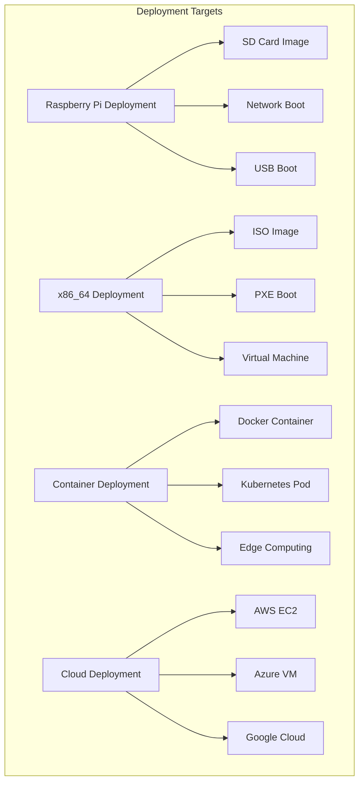
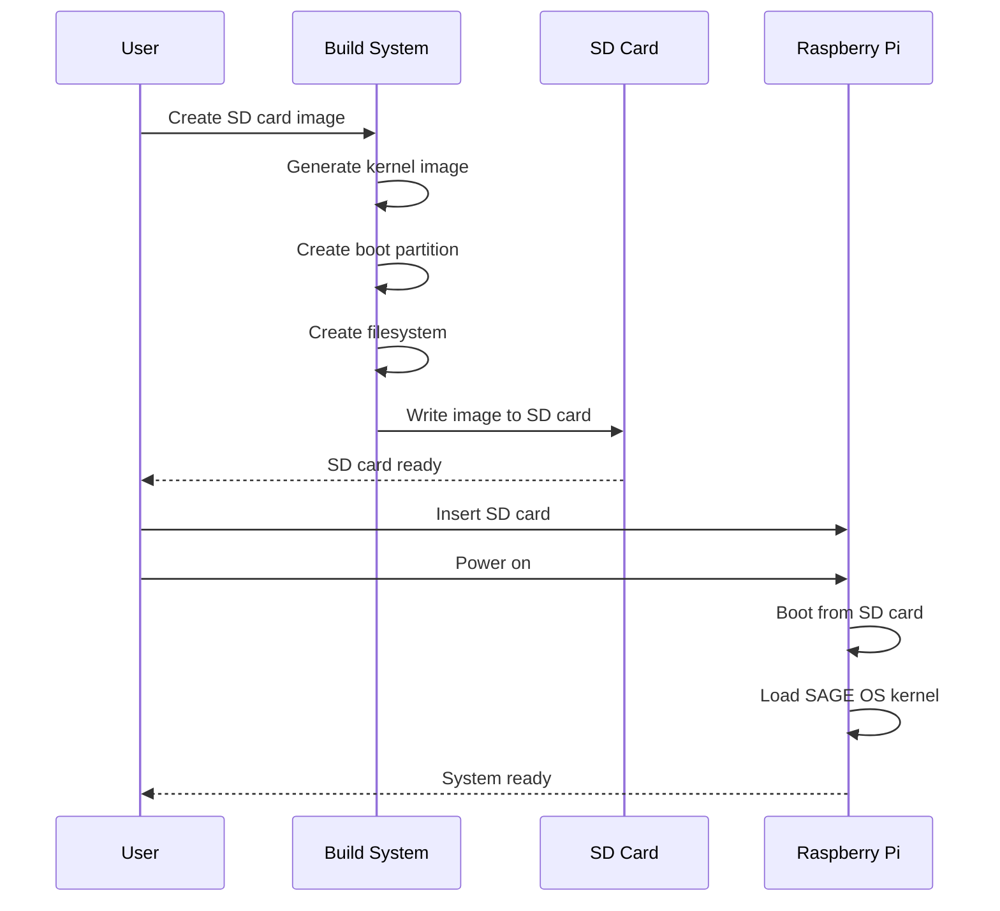
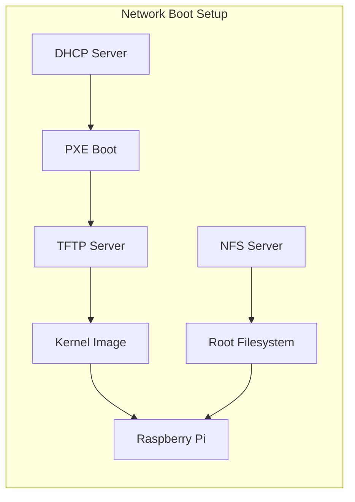
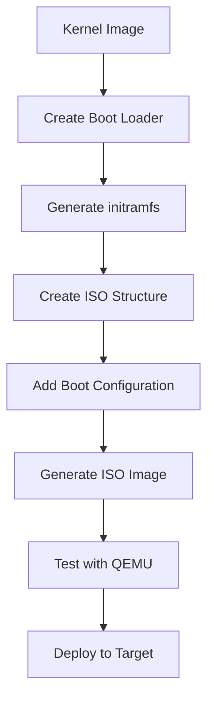
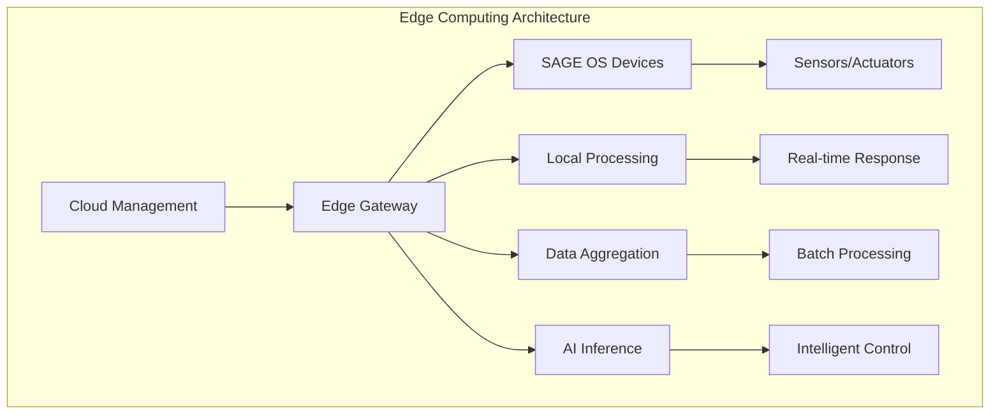
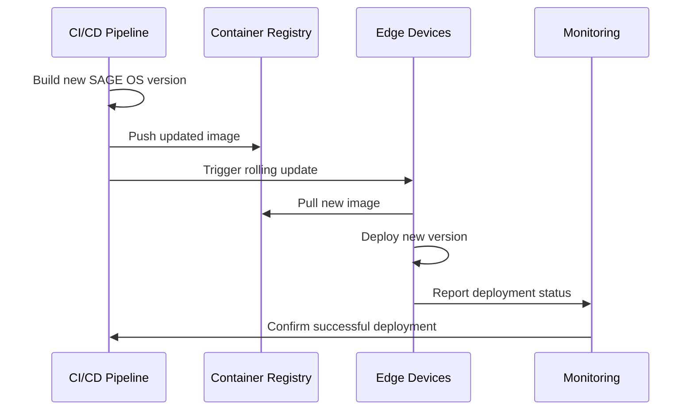

# SAGE OS Deployment Guide
{: .no_toc }

Comprehensive deployment documentation for production environments.
{: .fs-6 .fw-300 }

## Table of Contents
{: .no_toc .text-delta }

1. TOC
{:toc}

---

## Deployment Overview

SAGE OS supports multiple deployment scenarios across different platforms and environments.

### Deployment Architecture



## Raspberry Pi Deployment

### SD Card Deployment

#### Prerequisites

- MicroSD card (minimum 8GB, Class 10 recommended)
- SD card reader
- Raspberry Pi 4 or 5
- Power supply (5V 3A for Pi 4, 5V 5A for Pi 5)

#### Deployment Process



#### Step-by-Step Instructions

1. **Build the kernel image**:
   ```bash
   # For Raspberry Pi 4
   ./build-macos.sh
   # Select option 2: Build for Raspberry Pi 4 (ARM64)
   
   # For Raspberry Pi 5
   ./build-macos.sh
   # Select option 3: Build for Raspberry Pi 5 (ARM64)
   ```

2. **Create SD card image**:
   ```bash
   ./build-macos.sh
   # Select option 6: Create SD card image for Raspberry Pi
   ```

3. **Flash to SD card**:
   ```bash
   # Linux/WSL
   sudo dd if=sage-os-rpi4.img of=/dev/sdX bs=4M status=progress
   
   # macOS
   sudo dd if=sage-os-rpi4.img of=/dev/diskX bs=4m
   ```

4. **Boot configuration**:
   ```bash
   # Mount boot partition
   mount /dev/sdX1 /mnt/boot
   
   # Edit config.txt
   echo "kernel=kernel-aarch64-rpi4.img" >> /mnt/boot/config.txt
   echo "arm_64bit=1" >> /mnt/boot/config.txt
   
   # Unmount
   umount /mnt/boot
   ```

### Network Boot (PXE)

#### Network Boot Architecture



#### Configuration

1. **DHCP Server Setup**:
   ```bash
   # /etc/dhcp/dhcpd.conf
   subnet 192.168.1.0 netmask 255.255.255.0 {
       range 192.168.1.100 192.168.1.200;
       option routers 192.168.1.1;
       option domain-name-servers 8.8.8.8;
       
       # PXE boot configuration
       filename "bootcode.bin";
       next-server 192.168.1.10;
   }
   ```

2. **TFTP Server Setup**:
   ```bash
   # Install TFTP server
   sudo apt-get install tftpd-hpa
   
   # Copy boot files
   sudo cp build-output/kernel-aarch64-rpi4.img /var/lib/tftpboot/
   sudo cp firmware/* /var/lib/tftpboot/
   ```

3. **NFS Root Setup**:
   ```bash
   # Install NFS server
   sudo apt-get install nfs-kernel-server
   
   # Configure exports
   echo "/nfs/sage-os *(rw,sync,no_subtree_check,no_root_squash)" >> /etc/exports
   
   # Restart NFS
   sudo systemctl restart nfs-kernel-server
   ```

## x86_64 Deployment

### ISO Image Creation

#### ISO Build Process



#### Build ISO Image

```bash
# Create ISO image
./build-macos.sh
# Select option 7: Create ISO image for x86_64

# Or manually
./scripts/create-iso.sh x86_64
```

#### ISO Structure

```
sage-os.iso
├── boot/
│   ├── grub/
│   │   ├── grub.cfg
│   │   └── menu.lst
│   ├── kernel-x86_64-generic.img
│   └── initramfs.img
├── EFI/
│   └── BOOT/
│       └── BOOTX64.EFI
└── isolinux/
    ├── isolinux.bin
    ├── isolinux.cfg
    └── vesamenu.c32
```

### Virtual Machine Deployment

#### VMware Configuration

```yaml
# sage-os.vmx
.encoding = "UTF-8"
config.version = "8"
virtualHW.version = "19"
memsize = "2048"
ide0:0.present = "TRUE"
ide0:0.fileName = "sage-os.iso"
ide0:0.deviceType = "cdrom-image"
ethernet0.present = "TRUE"
ethernet0.connectionType = "nat"
guestOS = "other-64"
```

#### VirtualBox Configuration

```bash
# Create VM
VBoxManage createvm --name "SAGE-OS" --ostype "Other_64" --register

# Configure VM
VBoxManage modifyvm "SAGE-OS" --memory 2048 --vram 128
VBoxManage modifyvm "SAGE-OS" --nic1 nat
VBoxManage modifyvm "SAGE-OS" --boot1 dvd

# Attach ISO
VBoxManage storageattach "SAGE-OS" --storagectl "IDE" --port 0 --device 0 --type dvddrive --medium sage-os.iso

# Start VM
VBoxManage startvm "SAGE-OS"
```

#### QEMU Testing

```bash
# Test x86_64 build
qemu-system-x86_64 -cdrom sage-os.iso -m 2048 -enable-kvm

# Test with network
qemu-system-x86_64 -cdrom sage-os.iso -m 2048 -netdev user,id=net0 -device e1000,netdev=net0
```

## Container Deployment

### Docker Deployment

#### Dockerfile

```dockerfile
FROM scratch
COPY build-output/kernel-x86_64-generic.img /kernel.img
COPY rootfs/ /
EXPOSE 22 80 443
CMD ["/kernel.img"]
```

#### Docker Build and Run

```bash
# Build container
docker build -t sage-os:latest .

# Run container
docker run -d --name sage-os-container \
    --privileged \
    -p 2222:22 \
    -p 8080:80 \
    sage-os:latest

# Access container
docker exec -it sage-os-container /bin/sh
```

### Kubernetes Deployment

#### Deployment Manifest

```yaml
apiVersion: apps/v1
kind: Deployment
metadata:
  name: sage-os-deployment
  labels:
    app: sage-os
spec:
  replicas: 3
  selector:
    matchLabels:
      app: sage-os
  template:
    metadata:
      labels:
        app: sage-os
    spec:
      containers:
      - name: sage-os
        image: sage-os:latest
        ports:
        - containerPort: 80
        - containerPort: 22
        resources:
          requests:
            memory: "512Mi"
            cpu: "250m"
          limits:
            memory: "1Gi"
            cpu: "500m"
        securityContext:
          privileged: true
---
apiVersion: v1
kind: Service
metadata:
  name: sage-os-service
spec:
  selector:
    app: sage-os
  ports:
    - protocol: TCP
      port: 80
      targetPort: 80
      name: http
    - protocol: TCP
      port: 22
      targetPort: 22
      name: ssh
  type: LoadBalancer
```

#### Deploy to Kubernetes

```bash
# Apply deployment
kubectl apply -f sage-os-deployment.yaml

# Check status
kubectl get pods -l app=sage-os
kubectl get services sage-os-service

# Scale deployment
kubectl scale deployment sage-os-deployment --replicas=5

# Update deployment
kubectl set image deployment/sage-os-deployment sage-os=sage-os:v2.0
```

## Cloud Deployment

### AWS EC2 Deployment

#### AMI Creation

```bash
# Create EC2 instance
aws ec2 run-instances \
    --image-id ami-0abcdef1234567890 \
    --count 1 \
    --instance-type t3.medium \
    --key-name my-key-pair \
    --security-group-ids sg-903004f8 \
    --subnet-id subnet-6e7f829e

# Upload SAGE OS image
scp sage-os.iso ec2-user@instance-ip:/tmp/

# Create custom AMI
aws ec2 create-image \
    --instance-id i-1234567890abcdef0 \
    --name "SAGE-OS-AMI" \
    --description "SAGE OS Custom AMI"
```

#### Auto Scaling Configuration

```yaml
# CloudFormation template
AWSTemplateFormatVersion: '2010-09-09'
Resources:
  SAGEOSLaunchTemplate:
    Type: AWS::EC2::LaunchTemplate
    Properties:
      LaunchTemplateName: SAGE-OS-Template
      LaunchTemplateData:
        ImageId: ami-sage-os-custom
        InstanceType: t3.medium
        SecurityGroupIds:
          - !Ref SAGEOSSecurityGroup
        UserData:
          Fn::Base64: !Sub |
            #!/bin/bash
            # SAGE OS initialization script
            /opt/sage-os/init.sh
  
  SAGEOSAutoScalingGroup:
    Type: AWS::AutoScaling::AutoScalingGroup
    Properties:
      LaunchTemplate:
        LaunchTemplateId: !Ref SAGEOSLaunchTemplate
        Version: !GetAtt SAGEOSLaunchTemplate.LatestVersionNumber
      MinSize: 1
      MaxSize: 10
      DesiredCapacity: 3
      VPCZoneIdentifier:
        - subnet-12345678
        - subnet-87654321
```

### Azure Deployment

#### Azure VM Creation

```bash
# Create resource group
az group create --name SAGE-OS-RG --location eastus

# Create VM
az vm create \
    --resource-group SAGE-OS-RG \
    --name SAGE-OS-VM \
    --image UbuntuLTS \
    --admin-username azureuser \
    --generate-ssh-keys \
    --custom-data cloud-init.txt

# Upload SAGE OS
az vm run-command invoke \
    --resource-group SAGE-OS-RG \
    --name SAGE-OS-VM \
    --command-id RunShellScript \
    --scripts "wget https://releases.sage-os.org/latest/sage-os.iso"
```

#### Azure Container Instances

```yaml
apiVersion: 2019-12-01
location: eastus
name: sage-os-container-group
properties:
  containers:
  - name: sage-os
    properties:
      image: sage-os:latest
      resources:
        requests:
          cpu: 1
          memoryInGb: 2
      ports:
      - port: 80
        protocol: TCP
      - port: 22
        protocol: TCP
  osType: Linux
  ipAddress:
    type: Public
    ports:
    - protocol: TCP
      port: 80
    - protocol: TCP
      port: 22
```

## Edge Computing Deployment

### IoT Edge Deployment

#### Edge Device Configuration



#### Edge Deployment Script

```bash
#!/bin/bash
# edge-deploy.sh

# Configuration
EDGE_DEVICE_IP="192.168.1.100"
SAGE_OS_IMAGE="kernel-aarch64-rpi4.img"

# Deploy to edge device
echo "Deploying SAGE OS to edge device..."

# Copy kernel image
scp build-output/$SAGE_OS_IMAGE pi@$EDGE_DEVICE_IP:/boot/

# Update boot configuration
ssh pi@$EDGE_DEVICE_IP "echo 'kernel=$SAGE_OS_IMAGE' >> /boot/config.txt"

# Restart device
ssh pi@$EDGE_DEVICE_IP "sudo reboot"

echo "Deployment complete. Device will boot with SAGE OS."
```

### Industrial IoT Deployment

#### Factory Automation Setup

```yaml
# docker-compose.yml for industrial deployment
version: '3.8'
services:
  sage-os-controller:
    image: sage-os:industrial
    privileged: true
    network_mode: host
    volumes:
      - /dev:/dev
      - ./config:/etc/sage-os
    environment:
      - SAGE_MODE=industrial
      - SAGE_SAFETY_LEVEL=high
    restart: always
  
  sage-os-monitor:
    image: sage-os:monitoring
    ports:
      - "3000:3000"
    volumes:
      - ./monitoring:/var/lib/monitoring
    depends_on:
      - sage-os-controller
  
  sage-os-ai:
    image: sage-os:ai-inference
    runtime: nvidia
    environment:
      - CUDA_VISIBLE_DEVICES=0
    volumes:
      - ./models:/opt/models
    depends_on:
      - sage-os-controller
```

## Security Hardening

### Secure Boot Configuration

#### Raspberry Pi Secure Boot

```bash
# Enable secure boot
echo "secure_boot=1" >> /boot/config.txt
echo "sign_kernel=1" >> /boot/config.txt

# Generate signing keys
openssl genrsa -out kernel-signing-key.pem 2048
openssl req -new -x509 -key kernel-signing-key.pem -out kernel-signing-cert.pem -days 365

# Sign kernel image
sbsign --key kernel-signing-key.pem --cert kernel-signing-cert.pem \
       --output kernel-aarch64-rpi4-signed.img \
       kernel-aarch64-rpi4.img
```

#### x86_64 UEFI Secure Boot

```bash
# Create UEFI bootloader
grub-mkstandalone -O x86_64-efi \
    --modules="part_gpt part_msdos" \
    --fonts="unicode" \
    --themes="" \
    --output=bootx64.efi \
    "boot/grub/grub.cfg=grub.cfg"

# Sign bootloader
sbsign --key secure-boot-key.pem \
       --cert secure-boot-cert.pem \
       --output bootx64-signed.efi \
       bootx64.efi
```

### Network Security

#### Firewall Configuration

```bash
# iptables rules for SAGE OS
iptables -A INPUT -i lo -j ACCEPT
iptables -A INPUT -m conntrack --ctstate ESTABLISHED,RELATED -j ACCEPT
iptables -A INPUT -p tcp --dport 22 -j ACCEPT
iptables -A INPUT -p tcp --dport 80 -j ACCEPT
iptables -A INPUT -p tcp --dport 443 -j ACCEPT
iptables -A INPUT -j DROP

# Save rules
iptables-save > /etc/iptables/rules.v4
```

#### VPN Configuration

```bash
# OpenVPN server configuration
port 1194
proto udp
dev tun
ca ca.crt
cert sage-os-server.crt
key sage-os-server.key
dh dh2048.pem
server 10.8.0.0 255.255.255.0
push "redirect-gateway def1 bypass-dhcp"
push "dhcp-option DNS 8.8.8.8"
keepalive 10 120
comp-lzo
persist-key
persist-tun
status openvpn-status.log
log-append /var/log/openvpn.log
verb 3
```

## Monitoring and Maintenance

### System Monitoring

#### Prometheus Configuration

```yaml
# prometheus.yml
global:
  scrape_interval: 15s

scrape_configs:
  - job_name: 'sage-os'
    static_configs:
      - targets: ['localhost:9090']
    metrics_path: /metrics
    scrape_interval: 5s

  - job_name: 'sage-os-ai'
    static_configs:
      - targets: ['localhost:9091']
    metrics_path: /ai/metrics
```

#### Grafana Dashboard

```json
{
  "dashboard": {
    "title": "SAGE OS Monitoring",
    "panels": [
      {
        "title": "CPU Usage",
        "type": "graph",
        "targets": [
          {
            "expr": "100 - (avg(irate(node_cpu_seconds_total{mode=\"idle\"}[5m])) * 100)"
          }
        ]
      },
      {
        "title": "Memory Usage",
        "type": "graph",
        "targets": [
          {
            "expr": "(1 - (node_memory_MemAvailable_bytes / node_memory_MemTotal_bytes)) * 100"
          }
        ]
      },
      {
        "title": "AI Inference Rate",
        "type": "graph",
        "targets": [
          {
            "expr": "rate(sage_os_ai_inferences_total[5m])"
          }
        ]
      }
    ]
  }
}
```

### Automated Updates

#### Update Deployment Pipeline



#### Rolling Update Script

```bash
#!/bin/bash
# rolling-update.sh

DEVICES=(
    "192.168.1.100"
    "192.168.1.101"
    "192.168.1.102"
)

NEW_VERSION="sage-os:v2.1.0"

for device in "${DEVICES[@]}"; do
    echo "Updating device $device..."
    
    # Pull new image
    ssh pi@$device "docker pull $NEW_VERSION"
    
    # Stop old container
    ssh pi@$device "docker stop sage-os-container"
    
    # Start new container
    ssh pi@$device "docker run -d --name sage-os-container-new $NEW_VERSION"
    
    # Health check
    if ssh pi@$device "docker exec sage-os-container-new /health-check.sh"; then
        echo "Update successful on $device"
        ssh pi@$device "docker rm sage-os-container"
        ssh pi@$device "docker rename sage-os-container-new sage-os-container"
    else
        echo "Update failed on $device, rolling back..."
        ssh pi@$device "docker stop sage-os-container-new"
        ssh pi@$device "docker rm sage-os-container-new"
        ssh pi@$device "docker start sage-os-container"
    fi
done
```

## Next Steps

- [Testing Framework](../testing/) - Comprehensive testing procedures
- [API Reference](../api/) - Detailed API documentation
- [Architecture](../architecture/) - System architecture details
- [Contributing](../contributing/) - Development guidelines