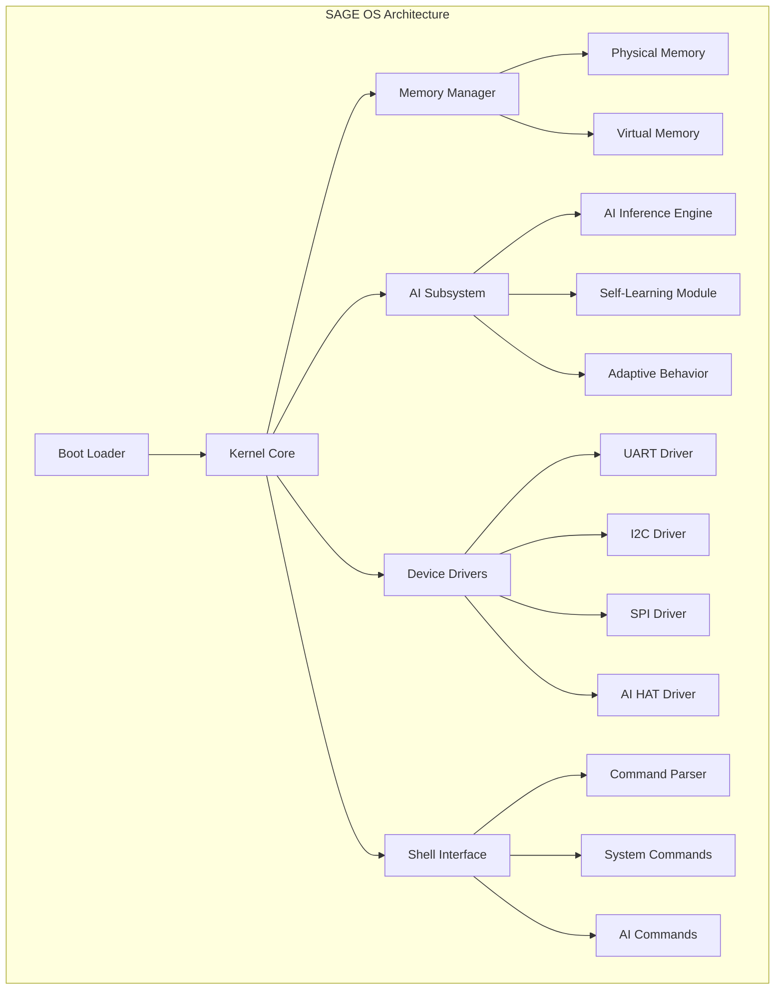
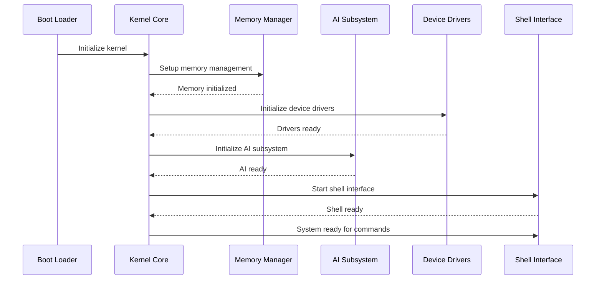
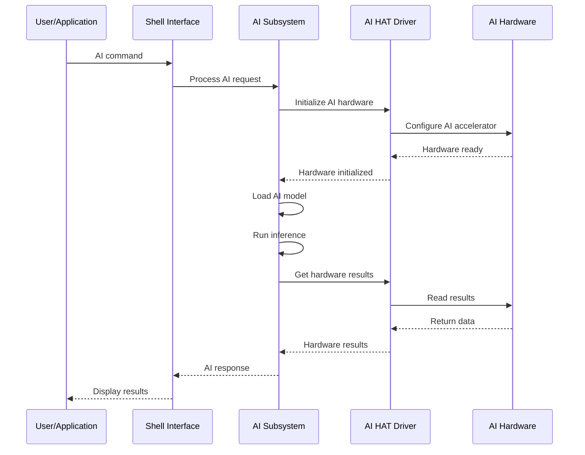

# SAGE OS Documentation
{: .no_toc }

Welcome to the comprehensive documentation for SAGE OS (Self-Aware General-purpose Embedded Operating System).
{: .fs-6 .fw-300 }

[Get Started](#quick-start){: .btn .btn-primary .fs-5 .mb-4 .mb-md-0 .mr-2 } [View on GitHub](https://github.com/hstream-app/SAGE-OS){: .btn .fs-5 .mb-4 .mb-md-0 }

---

## Table of Contents
{: .no_toc .text-delta }

1. TOC
{:toc}

---

## Overview

SAGE OS is a revolutionary operating system designed for embedded systems with AI capabilities. It features:

- **Multi-Architecture Support**: ARM64, ARM32, x86_64, RISC-V
- **AI Integration**: Built-in AI subsystem for intelligent operations
- **Self-Awareness**: Adaptive system behavior and resource management
- **Cross-Platform**: Raspberry Pi, Generic ARM, x86_64, RISC-V platforms
- **Real-Time Capabilities**: Optimized for embedded and IoT applications

## Quick Start

### Prerequisites

- Cross-compilation toolchains for target architectures
- QEMU for testing (optional)
- Git for version control

### Build Instructions

```bash
# Clone the repository
git clone https://github.com/hstream-app/SAGE-OS.git
cd SAGE-OS

# Build for all architectures (Linux/WSL)
chmod +x build-all-architectures.sh
./build-all-architectures.sh

# Build for macOS (excludes RISC-V)
chmod +x build-all-macos.sh
./build-all-macos.sh
```

### Testing

```bash
# Test with QEMU
./run_qemu.sh aarch64 rpi4

# Run comprehensive tests
./test-all-builds.sh
```

## Architecture Overview



## System Components

### Core Kernel
- **kernel.c**: Main kernel initialization and core functions
- **memory.c**: Memory management and allocation
- **shell.c**: Interactive command shell
- **stdio.c**: Standard I/O operations
- **utils.c**: Utility functions and helpers

### AI Subsystem
- **ai_subsystem.c**: Core AI functionality and inference
- **ai_hat.c**: AI HAT hardware driver for Raspberry Pi

### Device Drivers
- **uart.c**: Universal Asynchronous Receiver-Transmitter
- **i2c.c**: Inter-Integrated Circuit communication
- **spi.c**: Serial Peripheral Interface
- **ai_hat.c**: AI acceleration hardware support

### Boot System
- **boot.S**: Assembly boot loader for system initialization

## Build System

SAGE OS uses a sophisticated multi-architecture build system:

### Supported Targets

| Architecture | Platforms | Status |
|-------------|-----------|---------|
| **aarch64** | rpi4, rpi5, generic | ✅ Fully Supported |
| **arm** | rpi4, rpi5, generic | ✅ Fully Supported |
| **x86_64** | generic | ✅ Fully Supported |
| **riscv64** | generic | ✅ Linux Only |

### Build Scripts

- `build-all-architectures.sh`: Complete multi-arch build (Linux/WSL)
- `build-all-macos.sh`: macOS-compatible build (excludes RISC-V)
- `build-macos.sh`: Interactive macOS build system
- `build.sh`: Core build script with individual architecture support

## Documentation Structure

- [**Architecture**](architecture/): Detailed system architecture and design
- [**API Reference**](api/): Complete API documentation for all modules
- [**Build Guide**](build/): Comprehensive build instructions and troubleshooting
- [**Deployment**](deployment/): Production deployment guides
- [**Testing**](testing/): Testing framework and procedures
- [**Contributing**](contributing/): Development guidelines and contribution process

## Sequence Diagrams

### System Boot Sequence



### AI Inference Flow



## Getting Help

- **Issues**: [GitHub Issues](https://github.com/hstream-app/SAGE-OS/issues)
- **Discussions**: [GitHub Discussions](https://github.com/hstream-app/SAGE-OS/discussions)
- **Documentation**: This site and inline code comments
- **Contributing**: See [Contributing Guide](contributing/)

## License

SAGE OS is dual-licensed under:
- **BSD 3-Clause License** for open-source use
- **Commercial License** for proprietary applications

See [LICENSE](https://github.com/hstream-app/SAGE-OS/blob/main/LICENSE) for details.

---

*Last updated: {{ site.time | date: "%B %d, %Y" }}*