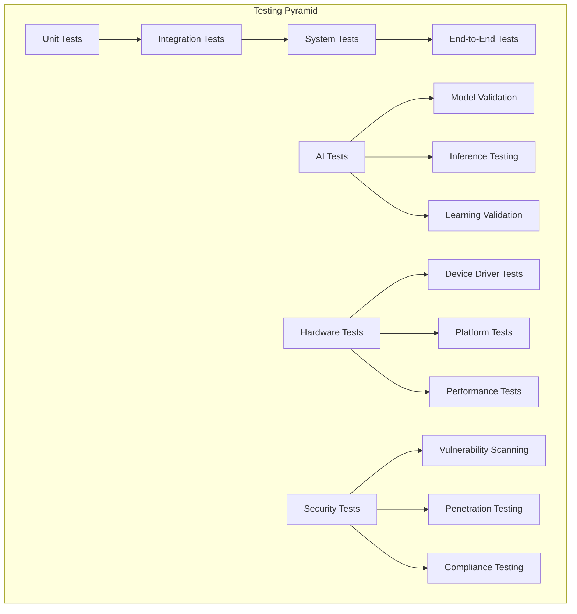
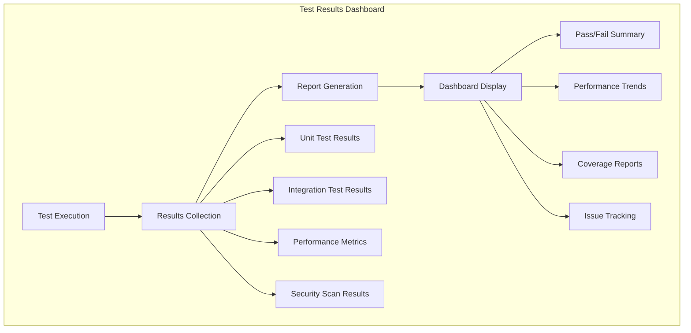

# SAGE OS Testing Framework
{: .no_toc }

Comprehensive testing documentation for SAGE OS development and deployment.
{: .fs-6 .fw-300 }

## Table of Contents
{: .no_toc .text-delta }

1. TOC
{:toc}

---

## Testing Overview

SAGE OS employs a multi-layered testing strategy covering unit tests, integration tests, system tests, and AI-specific validation.

### Testing Architecture



## Test Categories

### 1. Core System Tests

#### Kernel Tests (`tests/core_tests/`)

**Boot Sequence Testing**
```python
# test_boot_sequence.py
import pytest
from sage_os_test import SAGEOSTestFramework

class TestBootSequence:
    def setup_method(self):
        self.test_framework = SAGEOSTestFramework()
    
    def test_kernel_initialization(self):
        """Test kernel initialization sequence"""
        result = self.test_framework.boot_kernel()
        assert result.success == True
        assert "Kernel initialized" in result.output
        assert result.boot_time < 5.0  # Boot within 5 seconds
    
    def test_memory_initialization(self):
        """Test memory manager initialization"""
        result = self.test_framework.check_memory_init()
        assert result.total_memory > 0
        assert result.free_memory > 0
        assert result.kernel_memory > 0
    
    def test_driver_initialization(self):
        """Test device driver initialization"""
        drivers = self.test_framework.get_loaded_drivers()
        expected_drivers = ['uart', 'i2c', 'spi', 'ai_hat']
        
        for driver in expected_drivers:
            assert driver in drivers
            assert drivers[driver].status == 'loaded'
```

**Memory Management Testing**
```python
# test_memory_management.py
class TestMemoryManagement:
    def test_kmalloc_basic(self):
        """Test basic kernel memory allocation"""
        ptr = self.test_framework.kmalloc(1024)
        assert ptr is not None
        assert self.test_framework.is_valid_pointer(ptr)
        
        # Test memory write/read
        test_data = b"Hello, SAGE OS!"
        self.test_framework.write_memory(ptr, test_data)
        read_data = self.test_framework.read_memory(ptr, len(test_data))
        assert read_data == test_data
        
        # Free memory
        result = self.test_framework.kfree(ptr)
        assert result.success == True
    
    def test_memory_leak_detection(self):
        """Test for memory leaks"""
        initial_memory = self.test_framework.get_memory_stats()
        
        # Allocate and free memory multiple times
        for i in range(1000):
            ptr = self.test_framework.kmalloc(1024)
            self.test_framework.kfree(ptr)
        
        final_memory = self.test_framework.get_memory_stats()
        assert final_memory.free_memory == initial_memory.free_memory
    
    def test_virtual_memory_mapping(self):
        """Test virtual memory mapping"""
        virt_addr = 0x10000000
        phys_addr = self.test_framework.alloc_page()
        
        result = self.test_framework.map_page(virt_addr, phys_addr, 0x3)
        assert result.success == True
        
        # Test access through virtual address
        test_value = 0xDEADBEEF
        self.test_framework.write_memory(virt_addr, test_value)
        read_value = self.test_framework.read_memory(virt_addr, 4)
        assert read_value == test_value
```

### 2. AI Subsystem Tests

#### AI Functionality Tests (`tests/ai_tests/`)

**AI Inference Testing**
```python
# test_ai_behavior.py
class TestAIBehavior:
    def setup_method(self):
        self.ai_framework = AITestFramework()
        self.test_model = self.ai_framework.load_test_model("simple_classifier")
    
    def test_ai_initialization(self):
        """Test AI subsystem initialization"""
        result = self.ai_framework.init_ai_subsystem()
        assert result.success == True
        assert result.ai_hardware_detected == True
        assert len(result.loaded_models) > 0
    
    def test_basic_inference(self):
        """Test basic AI inference"""
        input_data = self.ai_framework.generate_test_input()
        
        result = self.ai_framework.run_inference(
            model=self.test_model,
            input_data=input_data
        )
        
        assert result.success == True
        assert result.inference_time < 100  # ms
        assert result.confidence > 0.5
        assert len(result.output) > 0
    
    def test_concurrent_inference(self):
        """Test concurrent AI inference requests"""
        import threading
        import time
        
        results = []
        
        def inference_worker():
            input_data = self.ai_framework.generate_test_input()
            result = self.ai_framework.run_inference(
                model=self.test_model,
                input_data=input_data
            )
            results.append(result)
        
        # Start multiple inference threads
        threads = []
        for i in range(10):
            thread = threading.Thread(target=inference_worker)
            threads.append(thread)
            thread.start()
        
        # Wait for completion
        for thread in threads:
            thread.join()
        
        # Verify all inferences completed successfully
        assert len(results) == 10
        for result in results:
            assert result.success == True
```

**Self-Learning Tests**
```python
# test_self_learning.py
class TestSelfLearning:
    def test_online_learning(self):
        """Test online learning capabilities"""
        # Generate training data
        training_data = self.ai_framework.generate_training_data(1000)
        
        # Get initial model performance
        initial_accuracy = self.ai_framework.evaluate_model(self.test_model)
        
        # Train with new data
        result = self.ai_framework.train_online(
            model=self.test_model,
            training_data=training_data
        )
        
        assert result.success == True
        
        # Check improved performance
        final_accuracy = self.ai_framework.evaluate_model(self.test_model)
        assert final_accuracy >= initial_accuracy
    
    def test_adaptive_behavior(self):
        """Test adaptive system behavior"""
        # Simulate system load
        self.ai_framework.simulate_high_load()
        
        # Check if AI adapts resource usage
        initial_resources = self.ai_framework.get_resource_usage()
        
        # Wait for adaptation
        time.sleep(5)
        
        adapted_resources = self.ai_framework.get_resource_usage()
        
        # Verify resource optimization
        assert adapted_resources.cpu_usage < initial_resources.cpu_usage
        assert adapted_resources.memory_usage <= initial_resources.memory_usage
```

### 3. Device Driver Tests

#### Hardware Interface Tests (`tests/integration_tests/`)

**UART Driver Testing**
```python
# test_io_devices.py
class TestUARTDriver:
    def setup_method(self):
        self.uart_port = 0
        self.test_framework = HardwareTestFramework()
    
    def test_uart_initialization(self):
        """Test UART driver initialization"""
        result = self.test_framework.uart_init(self.uart_port, 115200)
        assert result == 0  # SUCCESS
        
        # Verify configuration
        config = self.test_framework.uart_get_config(self.uart_port)
        assert config.baudrate == 115200
        assert config.data_bits == 8
        assert config.parity == 'none'
        assert config.stop_bits == 1
    
    def test_uart_loopback(self):
        """Test UART loopback communication"""
        # Enable loopback mode
        self.test_framework.uart_set_loopback(self.uart_port, True)
        
        test_data = b"SAGE OS UART Test"
        
        # Write data
        bytes_written = self.test_framework.uart_write(
            self.uart_port, test_data
        )
        assert bytes_written == len(test_data)
        
        # Read data back
        read_data = self.test_framework.uart_read(
            self.uart_port, len(test_data)
        )
        assert read_data == test_data
    
    def test_uart_interrupt_handling(self):
        """Test UART interrupt handling"""
        interrupt_count = 0
        
        def uart_interrupt_handler(port, event):
            nonlocal interrupt_count
            interrupt_count += 1
        
        # Register interrupt handler
        self.test_framework.uart_register_interrupt(
            self.uart_port, uart_interrupt_handler
        )
        
        # Generate interrupt by sending data
        self.test_framework.uart_write(self.uart_port, b"test")
        
        # Wait for interrupt
        time.sleep(0.1)
        
        assert interrupt_count > 0
```

**I2C Driver Testing**
```python
class TestI2CDriver:
    def test_i2c_device_scan(self):
        """Test I2C device scanning"""
        devices = self.test_framework.i2c_scan(bus=1)
        
        # Should find at least one device (test device)
        assert len(devices) > 0
        
        # Verify device addresses are valid
        for addr in devices:
            assert 0x08 <= addr <= 0x77
    
    def test_i2c_register_access(self):
        """Test I2C register read/write"""
        device_addr = 0x48  # Test device address
        register_addr = 0x00
        test_value = 0xAB
        
        # Write to register
        result = self.test_framework.i2c_write_reg(
            bus=1, addr=device_addr, reg=register_addr, value=test_value
        )
        assert result == 0
        
        # Read back from register
        read_value = self.test_framework.i2c_read_reg(
            bus=1, addr=device_addr, reg=register_addr
        )
        assert read_value == test_value
```

### 4. Performance Tests

#### Benchmark Testing

```python
# test_performance.py
class TestPerformance:
    def test_boot_time_benchmark(self):
        """Benchmark system boot time"""
        boot_times = []
        
        for i in range(10):
            start_time = time.time()
            self.test_framework.cold_boot()
            boot_time = time.time() - start_time
            boot_times.append(boot_time)
        
        avg_boot_time = sum(boot_times) / len(boot_times)
        max_boot_time = max(boot_times)
        
        # Boot time requirements
        assert avg_boot_time < 3.0  # Average < 3 seconds
        assert max_boot_time < 5.0  # Maximum < 5 seconds
    
    def test_memory_allocation_performance(self):
        """Benchmark memory allocation performance"""
        allocation_times = []
        
        for size in [1024, 4096, 16384, 65536]:
            start_time = time.perf_counter()
            
            for i in range(1000):
                ptr = self.test_framework.kmalloc(size)
                self.test_framework.kfree(ptr)
            
            end_time = time.perf_counter()
            avg_time = (end_time - start_time) / 1000
            allocation_times.append(avg_time)
        
        # Performance requirements
        for avg_time in allocation_times:
            assert avg_time < 0.001  # < 1ms per allocation
    
    def test_ai_inference_performance(self):
        """Benchmark AI inference performance"""
        model_sizes = ['small', 'medium', 'large']
        performance_results = {}
        
        for model_size in model_sizes:
            model = self.ai_framework.load_test_model(model_size)
            inference_times = []
            
            for i in range(100):
                input_data = self.ai_framework.generate_test_input()
                start_time = time.perf_counter()
                
                result = self.ai_framework.run_inference(model, input_data)
                
                end_time = time.perf_counter()
                inference_times.append(end_time - start_time)
            
            performance_results[model_size] = {
                'avg_time': sum(inference_times) / len(inference_times),
                'max_time': max(inference_times),
                'min_time': min(inference_times)
            }
        
        # Performance requirements by model size
        assert performance_results['small']['avg_time'] < 0.010   # 10ms
        assert performance_results['medium']['avg_time'] < 0.050  # 50ms
        assert performance_results['large']['avg_time'] < 0.200   # 200ms
```

### 5. Security Tests

#### Security Validation (`tests/security_tests/`)

```python
# test_security_patches.py
class TestSecurity:
    def test_buffer_overflow_protection(self):
        """Test buffer overflow protection"""
        # Attempt to overflow a buffer
        large_input = b"A" * 10000
        
        result = self.test_framework.test_buffer_input(large_input)
        
        # Should not crash or allow overflow
        assert result.crashed == False
        assert result.memory_corruption == False
    
    def test_privilege_escalation_prevention(self):
        """Test privilege escalation prevention"""
        # Try to access kernel memory from user space
        kernel_addr = 0x80000000
        
        with pytest.raises(MemoryAccessViolation):
            self.test_framework.user_read_memory(kernel_addr)
    
    def test_encryption_functionality(self):
        """Test encryption/decryption functionality"""
        plaintext = b"Sensitive SAGE OS data"
        key = self.test_framework.generate_encryption_key()
        
        # Encrypt data
        encrypted = self.test_framework.encrypt_data(plaintext, key)
        assert encrypted != plaintext
        assert len(encrypted) >= len(plaintext)
        
        # Decrypt data
        decrypted = self.test_framework.decrypt_data(encrypted, key)
        assert decrypted == plaintext
```

## Test Automation

### Continuous Integration Testing

#### GitHub Actions Workflow

```yaml
# .github/workflows/test.yml
name: SAGE OS Test Suite

on:
  push:
    branches: [ main, develop ]
  pull_request:
    branches: [ main ]

jobs:
  unit-tests:
    runs-on: ubuntu-latest
    strategy:
      matrix:
        architecture: [aarch64, arm, x86_64, riscv64]
    
    steps:
    - uses: actions/checkout@v4
    
    - name: Install Dependencies
      run: |
        sudo apt-get update
        sudo apt-get install -y \
          gcc-aarch64-linux-gnu \
          gcc-arm-linux-gnueabihf \
          gcc-riscv64-linux-gnu \
          qemu-system-arm \
          qemu-system-aarch64 \
          qemu-system-x86 \
          qemu-system-riscv64 \
          python3-pytest
    
    - name: Build SAGE OS
      run: |
        make kernel ARCH=${{ matrix.architecture }} PLATFORM=generic
    
    - name: Run Unit Tests
      run: |
        python3 -m pytest tests/core_tests/ -v
    
    - name: Run Integration Tests
      run: |
        python3 -m pytest tests/integration_tests/ -v
    
    - name: Run AI Tests
      run: |
        python3 -m pytest tests/ai_tests/ -v
    
    - name: QEMU Boot Test
      run: |
        timeout 30 ./run_qemu.sh ${{ matrix.architecture }} generic || true
        grep "SAGE OS Ready" qemu.log

  performance-tests:
    runs-on: ubuntu-latest
    needs: unit-tests
    
    steps:
    - uses: actions/checkout@v4
    
    - name: Build Performance Test Suite
      run: |
        make performance-tests
    
    - name: Run Performance Benchmarks
      run: |
        python3 -m pytest tests/performance/ -v --benchmark-only
    
    - name: Upload Performance Results
      uses: actions/upload-artifact@v4
      with:
        name: performance-results
        path: performance-results.json

  security-tests:
    runs-on: ubuntu-latest
    needs: unit-tests
    
    steps:
    - uses: actions/checkout@v4
    
    - name: Run Security Tests
      run: |
        python3 -m pytest tests/security_tests/ -v
    
    - name: Static Analysis
      run: |
        cppcheck --enable=all --error-exitcode=1 kernel/ drivers/
    
    - name: Vulnerability Scan
      run: |
        ./scripts/vulnerability-scan.sh
```

### Test Execution Framework

#### Test Runner Script

```bash
#!/bin/bash
# test-runner.sh

set -e

# Configuration
TEST_ARCHITECTURES=("aarch64" "arm" "x86_64" "riscv64")
TEST_PLATFORMS=("rpi4" "rpi5" "generic")
QEMU_TIMEOUT=30

# Colors for output
RED='\033[0;31m'
GREEN='\033[0;32m'
YELLOW='\033[1;33m'
NC='\033[0m' # No Color

# Logging
log_info() {
    echo -e "${GREEN}[INFO]${NC} $1"
}

log_warn() {
    echo -e "${YELLOW}[WARN]${NC} $1"
}

log_error() {
    echo -e "${RED}[ERROR]${NC} $1"
}

# Test functions
run_unit_tests() {
    log_info "Running unit tests..."
    python3 -m pytest tests/core_tests/ -v --tb=short
    python3 -m pytest tests/ai_tests/ -v --tb=short
}

run_integration_tests() {
    log_info "Running integration tests..."
    python3 -m pytest tests/integration_tests/ -v --tb=short
}

run_performance_tests() {
    log_info "Running performance tests..."
    python3 -m pytest tests/performance/ -v --benchmark-only
}

run_security_tests() {
    log_info "Running security tests..."
    python3 -m pytest tests/security_tests/ -v --tb=short
}

test_qemu_boot() {
    local arch=$1
    local platform=$2
    
    log_info "Testing QEMU boot for $arch-$platform..."
    
    # Start QEMU in background
    timeout $QEMU_TIMEOUT ./run_qemu.sh $arch $platform > qemu-$arch-$platform.log 2>&1 &
    local qemu_pid=$!
    
    # Wait for boot completion or timeout
    sleep $QEMU_TIMEOUT
    
    # Check if SAGE OS booted successfully
    if grep -q "SAGE OS Ready" qemu-$arch-$platform.log; then
        log_info "✅ QEMU boot test passed for $arch-$platform"
        kill $qemu_pid 2>/dev/null || true
        return 0
    else
        log_error "❌ QEMU boot test failed for $arch-$platform"
        kill $qemu_pid 2>/dev/null || true
        return 1
    fi
}

# Main test execution
main() {
    log_info "Starting SAGE OS Test Suite"
    
    # Build all architectures
    log_info "Building all architectures..."
    ./build-all-architectures.sh
    
    # Run test suites
    run_unit_tests
    run_integration_tests
    run_performance_tests
    run_security_tests
    
    # Test QEMU boot for each architecture
    local boot_test_failures=0
    for arch in "${TEST_ARCHITECTURES[@]}"; do
        if [[ "$arch" == "riscv64" ]]; then
            # Only test generic platform for RISC-V
            test_qemu_boot $arch "generic" || ((boot_test_failures++))
        else
            for platform in "${TEST_PLATFORMS[@]}"; do
                test_qemu_boot $arch $platform || ((boot_test_failures++))
            done
        fi
    done
    
    # Summary
    if [[ $boot_test_failures -eq 0 ]]; then
        log_info "🎉 All tests passed!"
        exit 0
    else
        log_error "❌ $boot_test_failures boot tests failed"
        exit 1
    fi
}

# Execute main function
main "$@"
```

## Test Data and Fixtures

### Test Data Generation

```python
# test_data_generator.py
import random
import numpy as np
from typing import List, Tuple

class TestDataGenerator:
    def __init__(self, seed: int = 42):
        random.seed(seed)
        np.random.seed(seed)
    
    def generate_ai_input_data(self, shape: Tuple[int, ...]) -> np.ndarray:
        """Generate test input data for AI inference"""
        return np.random.randn(*shape).astype(np.float32)
    
    def generate_training_dataset(self, 
                                size: int, 
                                features: int, 
                                classes: int) -> Tuple[np.ndarray, np.ndarray]:
        """Generate training dataset for AI learning tests"""
        X = np.random.randn(size, features).astype(np.float32)
        y = np.random.randint(0, classes, size)
        return X, y
    
    def generate_memory_test_patterns(self) -> List[bytes]:
        """Generate memory test patterns"""
        patterns = [
            b'\x00' * 1024,  # All zeros
            b'\xFF' * 1024,  # All ones
            b'\xAA' * 1024,  # Alternating pattern
            b'\x55' * 1024,  # Inverse alternating
        ]
        
        # Random pattern
        random_pattern = bytes([random.randint(0, 255) for _ in range(1024)])
        patterns.append(random_pattern)
        
        return patterns
    
    def generate_uart_test_data(self) -> List[bytes]:
        """Generate UART communication test data"""
        return [
            b"Hello, SAGE OS!",
            b"UART Test Data",
            b"\x00\x01\x02\x03\x04\x05",  # Binary data
            b"A" * 256,  # Large data
            b"",  # Empty data
        ]
```

### Mock Hardware Framework

```python
# mock_hardware.py
class MockHardwareFramework:
    def __init__(self):
        self.uart_ports = {}
        self.i2c_buses = {}
        self.memory_regions = {}
        self.ai_hardware_state = "ready"
    
    def mock_uart_init(self, port: int, baudrate: int) -> int:
        """Mock UART initialization"""
        self.uart_ports[port] = {
            'baudrate': baudrate,
            'tx_buffer': bytearray(),
            'rx_buffer': bytearray(),
            'loopback': False
        }
        return 0  # SUCCESS
    
    def mock_uart_write(self, port: int, data: bytes) -> int:
        """Mock UART write operation"""
        if port not in self.uart_ports:
            return -1  # ERROR_INVALID
        
        uart = self.uart_ports[port]
        uart['tx_buffer'].extend(data)
        
        # If loopback enabled, copy to RX buffer
        if uart['loopback']:
            uart['rx_buffer'].extend(data)
        
        return len(data)
    
    def mock_uart_read(self, port: int, size: int) -> bytes:
        """Mock UART read operation"""
        if port not in self.uart_ports:
            return b''
        
        uart = self.uart_ports[port]
        data = bytes(uart['rx_buffer'][:size])
        uart['rx_buffer'] = uart['rx_buffer'][size:]
        
        return data
    
    def mock_ai_inference(self, input_data: np.ndarray) -> dict:
        """Mock AI inference operation"""
        if self.ai_hardware_state != "ready":
            return {'success': False, 'error': 'Hardware not ready'}
        
        # Simulate processing time
        time.sleep(0.01)
        
        # Generate mock output
        output_shape = (input_data.shape[0], 10)  # 10 classes
        output = np.random.randn(*output_shape).astype(np.float32)
        confidence = np.random.uniform(0.7, 0.95)
        
        return {
            'success': True,
            'output': output,
            'confidence': confidence,
            'inference_time': 0.01
        }
```

## Test Reporting

### Test Results Dashboard



### HTML Test Report Generator

```python
# test_report_generator.py
import json
import datetime
from jinja2 import Template

class TestReportGenerator:
    def __init__(self):
        self.template = Template("""
<!DOCTYPE html>
<html>
<head>
    <title>SAGE OS Test Report</title>
    <style>
        body { font-family: Arial, sans-serif; margin: 20px; }
        .header { background: #f0f0f0; padding: 20px; border-radius: 5px; }
        .summary { display: flex; gap: 20px; margin: 20px 0; }
        .metric { background: #e8f4f8; padding: 15px; border-radius: 5px; flex: 1; }
        .passed { color: green; }
        .failed { color: red; }
        .warning { color: orange; }
        table { width: 100%; border-collapse: collapse; margin: 20px 0; }
        th, td { border: 1px solid #ddd; padding: 8px; text-align: left; }
        th { background-color: #f2f2f2; }
    </style>
</head>
<body>
    <div class="header">
        <h1>SAGE OS Test Report</h1>
        <p>Generated: {{ timestamp }}</p>
        <p>Build: {{ build_info.version }} ({{ build_info.commit }})</p>
    </div>
    
    <div class="summary">
        <div class="metric">
            <h3>Test Summary</h3>
            <p>Total: {{ summary.total }}</p>
            <p class="passed">Passed: {{ summary.passed }}</p>
            <p class="failed">Failed: {{ summary.failed }}</p>
            <p class="warning">Skipped: {{ summary.skipped }}</p>
        </div>
        
        <div class="metric">
            <h3>Coverage</h3>
            <p>Line Coverage: {{ coverage.line }}%</p>
            <p>Branch Coverage: {{ coverage.branch }}%</p>
            <p>Function Coverage: {{ coverage.function }}%</p>
        </div>
        
        <div class="metric">
            <h3>Performance</h3>
            <p>Boot Time: {{ performance.boot_time }}s</p>
            <p>AI Inference: {{ performance.ai_inference }}ms</p>
            <p>Memory Allocation: {{ performance.memory_alloc }}μs</p>
        </div>
    </div>
    
    <h2>Test Results by Category</h2>
    
    <h3>{{ category.name }}</h3>
    <table>
        <tr>
            <th>Test Name</th>
            <th>Status</th>
            <th>Duration</th>
            <th>Details</th>
        </tr>
        
        <tr>
            <td>{{ test.name }}</td>
            <td class="{{ test.status }}">{{ test.status.upper() }}</td>
            <td>{{ test.duration }}s</td>
            <td>{{ test.details }}</td>
        </tr>
        
    </table>
    
    
    <h2>Architecture Test Matrix</h2>
    <table>
        <tr>
            <th>Architecture</th>
            <th>Platform</th>
            <th>Build</th>
            <th>Boot Test</th>
            <th>Unit Tests</th>
            <th>Integration Tests</th>
        </tr>
        
        <tr>
            <td>{{ arch_result.architecture }}</td>
            <td>{{ arch_result.platform }}</td>
            <td class="{{ arch_result.build_status }}">{{ arch_result.build_status.upper() }}</td>
            <td class="{{ arch_result.boot_status }}">{{ arch_result.boot_status.upper() }}</td>
            <td class="{{ arch_result.unit_status }}">{{ arch_result.unit_status.upper() }}</td>
            <td class="{{ arch_result.integration_status }}">{{ arch_result.integration_status.upper() }}</td>
        </tr>
        
    </table>
</body>
</html>
        """)
    
    def generate_report(self, test_results: dict) -> str:
        """Generate HTML test report"""
        return self.template.render(
            timestamp=datetime.datetime.now().strftime("%Y-%m-%d %H:%M:%S"),
            **test_results
        )
```

## Next Steps

- [Contributing Guidelines](../contributing/) - Development contribution process
- [API Reference](../api/) - Detailed API documentation
- [Build System](../build/) - Build and compilation guides
- [Deployment](../deployment/) - Production deployment procedures